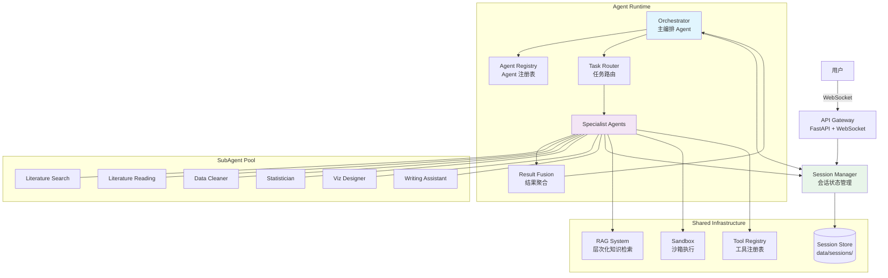
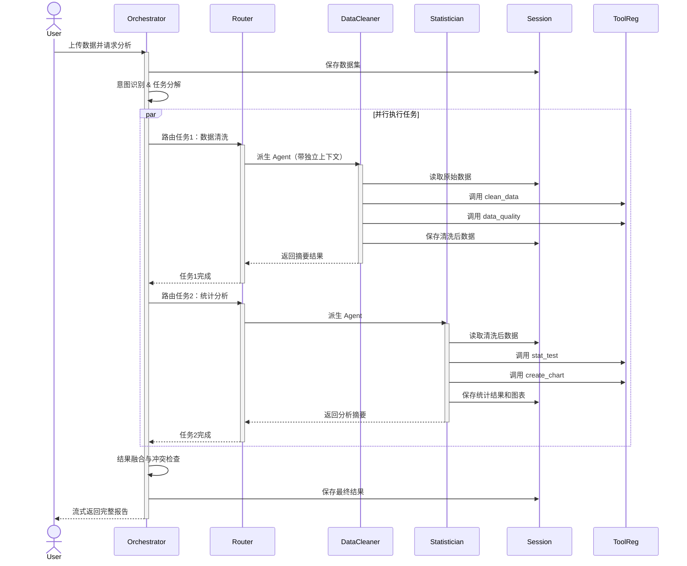

# Scientific Nini 多Agent协作架构规划

## 一、项目现状分析

### 1.1 项目定位与核心功能

**Scientific Nini** 是一个本地优先的科研数据分析 AI Agent。用户通过对话上传并分析数据，Agent 自动调用统计、作图、清洗、代码执行与报告生成技能。

**核心特点**：
- 对话式交互
- 多模型自动路由
- 沙箱安全执行
- 零代码数据分析

### 1.2 技术栈

| 层级 | 技术 |
|------|------|
| 后端 | Python >= 3.12, FastAPI, WebSocket |
| 前端 | React 18, Vite, TypeScript, Tailwind CSS |
| 模型路由 | OpenAI, Anthropic, Ollama, Moonshot, DeepSeek, 智谱, 阿里百炼 |
| 数据科学 | pandas, numpy, scipy, statsmodels, matplotlib, plotly |
| R 支持 | 本地 R 环境 / WebR |

### 1.3 现有能力

#### Tools（原子函数层 - 30+）

**统计分析**：
- `t_test`, `mann_whitney`（自动降级）
- `anova`, `kruskal_wallis`
- `correlation`, `regression`
- `multiple_comparison`

**可视化**：
- `create_chart`：7 种图表类型 + 6 种期刊风格
- `export_chart`：SVG/PDF/PNG 导出

**数据处理**：
- `load_dataset`, `preview_data`, `data_summary`
- `clean_data`, `data_quality`, `diagnostics`

**代码执行**：
- `run_code`：Python 沙箱（AST 静态分析 + 受限 builtins + 进程隔离）
- `run_r_code`：R 语言沙箱执行

**任务规划**：
- `task_write`：结构化任务列表生成
- `task_state`：任务状态跟踪

**产物生成**：
- `generate_report`, `export_report`
- `organize_workspace`

#### 架构亮点

1. **ReAct 循环**：`AgentRunner` 实现思考-行动循环，接收用户消息 → 构建上下文 → 调用 LLM → 解析 tool_calls → 执行 Skill → 循环直到完成

2. **三层架构**：
   - Tools（原子函数层）：模型可直接调用的工具
   - Skills（工作流层）：完整工作流项目（预留扩展）
   - Capabilities（能力层）：用户层面的能力元数据

3. **层次化 RAG**：
   - L0：文档级（标题匹配）
   - L1：章节级
   - L2：段落级
   - RRF 融合 + 上下文组装

4. **沙箱安全执行**：
   - AST 静态分析（`sandbox/policy.py`）
   - 受限 builtins（`sandbox/executor.py`）
   - 进程隔离（multiprocessing spawn）

5. **会话管理**：
   - 持久化路径：`data/sessions/{session_id}/`
   - `meta.json`：标题、压缩上下文、研究画像
   - `memory.jsonl`：对话历史
   - `workspace/`：上传文件和产物

6. **任务规划系统**：LLM 驱动的结构化任务列表，支持中断恢复

### 1.4 多Agent就绪度评估

| 维度 | 评分 | 说明 |
|------|------|------|
| 基础设施 | 5/5 | 完善的 ToolRegistry、Session 管理、RAG 知识库 |
| 通信机制 | 4/5 | WebSocket 事件流已就绪，需扩展 Agent 间协议 |
| 状态共享 | 4/5 | Session 已支持 datasets/artifacts 共享 |
| 动态扩展 | 3/5 | 需要新增 Agent 注册表和动态派生机制 |
| **综合** | **4/5** | **具备良好的多Agent扩展基础** |

---

## 二、科研场景全景图

### 2.1 科研全流程场景分析

| 场景 | 可行性 | 优先级 | 核心痛点 |
|------|--------|--------|----------|
| 文献检索与管理 | 5/5 | **高** | 关键词遗漏、手动筛选耗时、跨学科发现困难 |
| 文献精读与批注 | 4/5 | **高** | 英文阅读慢、图表提取繁琐、跨文献对比困难 |
| 实验数据清洗与分析 | 5/5 | **高** | 格式不统一、缺失值处理繁琐、质量难评估 |
| 统计建模与可视化 | 5/5 | **高** | 方法选择困难、软件学习曲线陡峭、图表美化耗时 |
| 论文撰写与润色 | 4/5 | **高** | 学术英语表达困难、期刊格式排版繁琐 |
| 思维导图与思路整理 | 4/5 | 中 | 手动绘制耗时、隐性关联难发现 |
| 引用管理与查重 | 4/5 | 中 | 引用格式易出错、查重报告解读困难 |
| 实验设计与方案制定 | 3/5 | 中 | 样本量计算复杂、设计类型选择困难 |
| 同行评审应对 | 3/5 | 低 | 审稿意见难以理解、优先级排序困难 |

### 2.2 能力缺口分析

当前 AI 工具在科研场景的普遍限制：

1. **多模态理解有限**：复杂科学图表、分子结构、数学公式理解不完善
2. **领域专业知识深度不足**：垂直领域的专业判断仍需人工
3. **长文本上下文限制**：处理长篇综述时存在信息丢失
4. **幻觉问题**：可能生成虚假引用或不存在的研究结果
5. **跨工具工作流整合**：文献管理、数据分析、写作工具缺乏无缝衔接

---

## 三、多Agent最佳实践参考

### 3.1 主流框架对比

| 框架 | 架构 | 核心哲学 | 适用场景 |
|------|------|---------|---------|
| **LangGraph** | 图状态机 | 确定性控制 | 复杂企业工作流、需要审计追踪 |
| **AutoGen/AG2** | 对话协作 | 涌现协作 | 研究系统、代码审查、科学分析 |
| **CrewAI** | 角色化层次 | 结构化委托 | 业务自动化、营销、客服 |
| **OpenAI Agents SDK** | 去中心化 | 自主 handoff | 对话式 AI、快速原型 |

### 3.2 推荐模式（针对科研场景）

基于 Scientific Nini 的特点，推荐采用 **主Agent-子Agent层次结构 + 动态派生** 的混合模式：

#### 核心设计原则

1. **专业化优于泛化**：每个 Agent 窄而精，专注 1-2 个核心场景
2. **上下文隔离**：子 Agent 独立上下文，通过摘要返回主 Agent，避免污染
3. **可观测性**：内置 tracing 和 checkpoint，支持执行过程可视化
4. **并行执行**：2-4 个 Agent 同时运行，处理独立子任务
5. **模型配置与 Agent 解耦**：Agent 只声明用途（purpose），实际模型由用户通过配置指定

#### 模型路由与 Agent 配置

Scientific Nini 已有多模型路由机制（`ModelResolver`），支持按用途选择模型：

| 用途标识 | 适用场景 | 可配置参数 |
|---------|---------|-----------|
| `analysis` | 数据分析、文献理解、统计检验 | `NINI_ANALYSIS_MODEL`, `NINI_ANALYSIS_PROVIDER` |
| `coding` | 代码生成、脚本编写 | `NINI_CODING_MODEL`, `NINI_CODING_PROVIDER` |
| `vision` | 图像分析、图表理解 | `NINI_VISION_MODEL`, `NINI_VISION_PROVIDER` |
| `default` | 通用对话、简单任务 | `NINI_DEFAULT_MODEL`, `NINI_DEFAULT_PROVIDER` |

**配置示例**（`.env` 文件）：
```bash
# 为 analysis 用途配置 Claude
NINI_ANALYSIS_PROVIDER=anthropic
NINI_ANALYSIS_MODEL=claude-sonnet-4-20250514

# 为 coding 用途配置 OpenAI
NINI_CODING_PROVIDER=openai
NINI_CODING_MODEL=gpt-4o

# 使用本地 Ollama 降低成本
NINI_DEFAULT_PROVIDER=ollama
NINI_DEFAULT_MODEL=qwen2.5:7b
```

Agent 定义时只需指定 `purpose`，实际模型由 `ModelResolver` 根据用户配置动态解析。

#### 调度策略

| 策略 | 说明 | 适用场景 |
|------|------|---------|
| **串行** | 任务按依赖顺序执行 | 有明确先后依赖的分析流程 |
| **并行** | 多个 Agent 同时执行 | 独立的文献检索、数据清洗、统计检验 |
| **动态派生** | 按需生成 Specialist Agent | 复杂多步骤任务 |

#### 嵌套深度限制

| 层级 | 说明 | 建议 |
|------|------|------|
| L0 | 主 Agent（Orchestrator） | ✅ 必需 |
| L1 |  Specialist Agent | ✅ 推荐 |
| L2 | 子任务 Agent | ⚠️ 谨慎使用 |
| L3+ | 深层嵌套 | ❌ 不建议 |

### 3.3 通信协议设计

**状态共享**：
- 通过 Session 共享 datasets、artifacts、中间结果
- 使用 knowledge_memory 共享 RAG 检索结果

**消息传递**：
- 异步事件流（WebSocket）
- 事件类型：`agent_start` / `agent_progress` / `agent_complete` / `agent_error` / `workflow_status`

**结果聚合**：
- 分层融合策略：简单拼接 / LLM摘要 / 辩论共识 / 层次化融合（参考分层RAG的RRF融合思想）
- 冲突检测：数值型差异检测 + 分类结论不一致检测
- 冲突解决：置信度加权 + 辩论协议

---

## 四、架构设计方案

### 4.1 Agent角色规划

#### 主Agent：Orchestrator（编排器）

**职责**：
- 用户意图识别与任务分解
- Agent 调度与并行控制
- 结果聚合与冲突解决
- 会话状态管理

**Prompt 核心指令**：
```markdown
你是 Scientific Nini 的主编排 Agent（Orchestrator）。

你的职责：
1. 分析用户意图，识别需要哪些 Specialist Agent
2. 动态派生子 Agent，分配子任务
3. 收集子 Agent 结果，进行融合和冲突解决
4. 向用户呈现最终答案

规则：
- 不要直接执行分析任务，委派给 Specialist Agent
- 保持主上下文整洁，子 Agent 的详细输出不进入主上下文
- 使用 task_write 向用户展示执行计划
```

#### 子Agent角色定义表

| AgentID | 角色名称 | 专注场景 | 核心能力 | 建议用途路由 |
|---------|---------|---------|---------|-------------|
| `literature_search` | 文献检索专家 | 文献检索与管理 | 语义搜索、引用网络、元数据提取 | `analysis` |
| `literature_reading` | 文献精读专家 | 文献精读与批注 | PDF 解析、图表提取、跨文献对比 | `analysis` |
| `data_cleaner` | 数据清洗专家 | 数据清洗与预处理 | 缺失值处理、异常检测、格式转换 | `analysis` |
| `statistician` | 统计分析专家 | 统计建模与检验 | 方法推荐、假设检验、结果解释 | `analysis` |
| `viz_designer` | 可视化设计师 | 科研图表生成 | 图表美化、期刊风格、交互可视化 | `analysis` |
| `writing_assistant` | 学术写作助手 | 论文撰写与润色 | 学术英语、期刊格式、逻辑组织 | `analysis` |
| `research_planner` | 研究规划师 | 思维导图、实验设计 | 知识图谱、主题建模、样本量计算 | `analysis` |
| `citation_manager` | 引用管理专家 | 引用管理、查重 | 引文格式、文献库同步 | `default` |
| `review_assistant` | 审稿助手 | 同行评审应对 | 意见分类、优先级排序 | `default` |

**说明**：
- `analysis`：分析型任务，需要较强的推理和结构化输出能力
- `default`：通用任务，使用默认模型配置即可
- 具体模型由用户通过环境变量或配置文件指定（如 `NINI_ANALYSIS_MODEL`）

#### 子Agent配置示例（literature_search）

```yaml
# .claude/agents/literature_search.yaml
name: literature_search
description: 文献检索与管理专家，擅长语义搜索、引用网络分析和文献去重
purpose: analysis  # 使用 analysis 用途路由，具体模型由用户配置
system_prompt: |
  你是 Scientific Nini 的文献检索专家。

  你的职责：
  1. 执行语义/概念搜索，发现相关文献
  2. 构建引用网络图谱，识别高影响力论文
  3. 自动提取文献元数据（标题、作者、摘要、关键词）
  4. 进行文献去重和分类管理

  可用工具：
  - fetch_url：抓取网页和文献数据库
  - knowledge_search：查询本地知识库
  - task_write：报告检索进度

  输出格式：
  - 检索结果摘要（限制在 500 字以内）
  - 关键文献列表（标题、作者、相关性评分）
  - 下一步建议
```

**配置说明**：
- `purpose`：指定用途路由（`analysis`/`coding`/`vision`/`default` 等）
- 实际使用的模型由 `ModelResolver` 根据用户配置解析，例如：
  - 用户配置 `NINI_ANALYSIS_MODEL=gpt-4o` 则使用 GPT-4o
  - 用户配置 `NINI_ANALYSIS_MODEL=claude-sonnet-4-20250514` 则使用 Claude
  - 也可通过 `NINI_PURPOSE_ANALYSIS_PROVIDER` 和 `NINI_PURPOSE_ANALYSIS_MODEL` 精细配置

### 4.2 系统架构图



### 4.3 主/子Agent交互时序图



### 4.4 关键接口伪代码

#### 4.4.1 Agent注册表

```python
# agent/registry.py

# 注：以下数据类需要在实际实现中定义
# - SubSession: 子Agent会话上下文
# - RoutingDecision: 路由决策结果
# - Conflict: 结果冲突描述
# - FusionResult: 融合结果

@dataclass
class AgentDefinition:
    """Agent 定义"""
    agent_id: str                    # 唯一标识
    name: str                        # 显示名称
    description: str                 # 能力描述
    system_prompt: str               # 系统提示词
    purpose: str                     # 用途路由（如 analysis/coding/vision/default）
    allowed_tools: list[str]         # 可用工具列表
    max_tokens: int                  # 上下文限制
    timeout_seconds: int             # 超时时间


class AgentRegistry:
    """Agent 注册中心"""

    def __init__(self):
        self._agents: dict[str, AgentDefinition] = {}
        self._load_builtin_agents()
        self._load_custom_agents()

    def _load_builtin_agents(self) -> None:
        """加载内置 Agent 定义"""
        builtin_agents = [
            AgentDefinition(
                agent_id="literature_search",
                name="文献检索专家",
                description="擅长语义搜索、引用网络分析",
                system_prompt=load_prompt("agents/literature_search.txt"),
                purpose="analysis",  # 使用 analysis 用途路由
                allowed_tools=["fetch_url", "knowledge_search", "task_write"],
                max_tokens=8000,
                timeout_seconds=300,
            ),
            # ... 其他内置 Agent
        ]
        for agent in builtin_agents:
            self.register(agent)

    def _load_custom_agents(self) -> None:
        """从 .claude/agents/ 加载自定义 Agent"""
        custom_dir = Path(".claude/agents")
        if custom_dir.exists():
            for yaml_file in custom_dir.glob("*.yaml"):
                agent_def = self._parse_agent_yaml(yaml_file)
                self.register(agent_def)

    def register(self, agent_def: AgentDefinition) -> None:
        """注册 Agent"""
        self._agents[agent_def.agent_id] = agent_def

    def get(self, agent_id: str) -> AgentDefinition | None:
        """获取 Agent 定义"""
        return self._agents.get(agent_id)

    def list_agents(self, capability: str | None = None) -> list[AgentDefinition]:
        """列出所有 Agent，可按能力过滤"""
        agents = list(self._agents.values())
        if capability:
            agents = [a for a in agents if capability in a.description]
        return agents

    def match_for_task(self, task_description: str) -> list[AgentDefinition]:
        """根据任务描述匹配最合适的 Agent"""
        # 使用 embedding 相似度或 LLM 进行匹配
        matches = []
        for agent in self._agents.values():
            score = self._compute_match_score(task_description, agent)
            if score > 0.7:
                matches.append((agent, score))
        return [a for a, _ in sorted(matches, key=lambda x: x[1], reverse=True)]
```

#### 4.4.2 Session 隔离机制

子 Agent（SubAgent）使用独立的 `SubSession` 上下文，与主 Agent（Orchestrator）隔离：

```python
@dataclass
class SubSession:
    """子 Agent 独立会话上下文"""
    parent_session_id: str          # 父会话ID（用于共享数据集）
    agent_id: str                   # 子 Agent 类型ID
    session_id: str = field(default_factory=lambda: uuid.uuid4().hex[:12])

    # 共享数据（只读访问）
    shared_datasets: dict[str, pd.DataFrame] = field(default_factory=dict)

    # 独立上下文
    messages: list[dict] = field(default_factory=list)
    compressed_history: str = ""    # 父会话历史摘要

    # 产物输出
    artifacts: dict[str, Any] = field(default_factory=dict)

    def get_dataset(self, name: str) -> pd.DataFrame | None:
        """只读访问共享数据集"""
        return self.shared_datasets.get(name)

    def save_artifact(self, name: str, data: Any) -> None:
        """保存产物，将被同步到父会话"""
        self.artifacts[name] = data
```

#### 4.4.3 动态派生机制

```python
# agent/spawner.py

import asyncio
from dataclasses import dataclass
from typing import Any


@dataclass
class SubAgentResult:
    """子 Agent（SubAgent）执行结果"""
    agent_id: str
    success: bool
    summary: str                    # 返回给主 Agent 的摘要
    detailed_output: dict | None    # 详细输出（可选）
    artifacts: list[str]            # 生成的产物ID列表
    token_usage: int
    execution_time_ms: int


class SubAgentSpawner:
    """子 Agent（SubAgent）动态派生器

    支持失败重试和回退机制：
    - 每个子 Agent 最多重试 3 次
    - 失败时回退到主 Agent（Orchestrator）直接处理
    - 超时自动终止并报告
    """

    def __init__(
        self,
        registry: AgentRegistry,
        session_manager: SessionManager,
        model_resolver: ModelResolver,
        max_retries: int = 3,
    ):
        self.registry = registry
        self.session_manager = session_manager
        self.model_resolver = model_resolver
        self.max_retries = max_retries
        self._active_agents: dict[str, asyncio.Task] = {}

    async def spawn(
        self,
        agent_id: str,
        task: str,
        session_id: str,
        parent_context: dict | None = None,
        timeout_seconds: int = 300,
    ) -> SubAgentResult:
        """
        动态派生子 Agent（SubAgent）

        Args:
            agent_id: Agent 类型ID
            task: 任务描述
            session_id: 所属会话ID
            parent_context: 父 Agent（Orchestrator）需要传递的上下文
            timeout_seconds: 超时时间

        Returns:
            SubAgentResult: 执行结果
        """
        agent_def = self.registry.get(agent_id)
        if not agent_def:
            raise ValueError(f"未知 Agent: {agent_id}")

        # 创建子 Agent 的独立会话上下文
        sub_session = self._create_sub_session(session_id, agent_id, parent_context)

        # 构建完整提示词
        system_prompt = self._build_system_prompt(agent_def, parent_context)
        messages = [
            {"role": "system", "content": system_prompt},
            {"role": "user", "content": task},
        ]

        # 执行子 Agent
        try:
            result = await asyncio.wait_for(
                self._execute_agent(agent_def, messages, sub_session),
                timeout=timeout_seconds,
            )
            return result
        except asyncio.TimeoutError:
            return SubAgentResult(
                agent_id=agent_id,
                success=False,
                summary=f"Agent {agent_id} 执行超时",
                detailed_output=None,
                artifacts=[],
                token_usage=0,
                execution_time_ms=timeout_seconds * 1000,
            )

    async def spawn_with_retry(
        self,
        agent_id: str,
        task: str,
        session_id: str,
        parent_context: dict | None = None,
        timeout_seconds: int = 300,
    ) -> SubAgentResult:
        """
        带重试机制的子 Agent（SubAgent）派生

        策略：
        1. 最多重试 max_retries 次
        2. 每次重试增加延迟（指数退避）
        3. 连续失败后回退到主 Agent 处理
        """
        for attempt in range(self.max_retries):
            try:
                result = await self.spawn(
                    agent_id, task, session_id, parent_context, timeout_seconds
                )
                if result.success:
                    return result
                # 失败但无异常，记录警告
                logger.warning(f"Agent {agent_id} 第 {attempt + 1} 次尝试失败")
            except Exception as e:
                logger.error(f"Agent {agent_id} 第 {attempt + 1} 次尝试异常: {e}")

            # 指数退避
            if attempt < self.max_retries - 1:
                delay = 2 ** attempt
                await asyncio.sleep(delay)

        # 所有重试失败，返回失败结果
        return SubAgentResult(
            agent_id=agent_id,
            success=False,
            summary=f"Agent {agent_id} 在 {self.max_retries} 次尝试后仍失败",
            detailed_output=None,
            artifacts=[],
            token_usage=0,
            execution_time_ms=0,
        )

    async def spawn_batch(
        self,
        tasks: list[tuple[str, str]],  # [(agent_id, task), ...]
        session_id: str,
        parent_context: dict | None = None,
        max_concurrency: int = 4,
    ) -> list[SubAgentResult]:
        """
        批量派生子 Agent（SubAgent）并行执行

        Args:
            tasks: 任务列表，每个元素为 (agent_id, task_description)
            max_concurrency: 最大并发数
        """
        semaphore = asyncio.Semaphore(max_concurrency)

        async def run_with_limit(agent_id: str, task: str) -> SubAgentResult:
            async with semaphore:
                return await self.spawn_with_retry(agent_id, task, session_id, parent_context)

        coros = [run_with_limit(aid, task) for aid, task in tasks]
        return await asyncio.gather(*coros, return_exceptions=True)

    def _create_sub_session(
        self,
        parent_session_id: str,
        agent_id: str,
        parent_context: dict | None,
    ) -> SubSession:
        """创建子 Agent（SubAgent）的独立会话上下文"""
        return SubSession(
            parent_session_id=parent_session_id,
            agent_id=agent_id,
            shared_datasets=parent_context.get("datasets", {}),
            compressed_history=parent_context.get("history_summary", ""),
        )

    def _build_system_prompt(
        self,
        agent_def: AgentDefinition,
        parent_context: dict | None,
    ) -> str:
        """构建子 Agent 的系统提示词"""
        base_prompt = agent_def.system_prompt

        # 添加上下文隔离指令
        isolation_instruction = """
        [上下文隔离指令]
        - 你是 Specialist Agent，专注执行分配给你的子任务
        - 使用 shared_datasets 访问会话数据
        - 完成后返回简洁的摘要，详细结果保存到 session
        - 不要假设主 Agent 知道你的执行细节
        """

        # 添加上下文摘要
        if parent_context and parent_context.get("history_summary"):
            context_section = f"""
        [会话上下文摘要]
        {parent_context['history_summary']}
        """
        else:
            context_section = ""

        return f"{base_prompt}\n{isolation_instruction}{context_section}"

    async def _execute_agent(
        self,
        agent_def: AgentDefinition,
        messages: list[dict],
        sub_session: SubSession,
    ) -> SubAgentResult:
        """执行子 Agent（SubAgent）的核心逻辑"""
        # 根据 purpose 获取模型客户端
        # ModelResolver 会根据用户配置选择实际模型
        model_client = await self.model_resolver.get_client_for_purpose(agent_def.purpose)

        # 使用现有的 AgentRunner 机制，但限制工具集
        runner = AgentRunner(
            model_client=model_client,
            tool_registry=self._create_restricted_registry(agent_def.allowed_tools),
            session=sub_session,
        )

        # 执行 ReAct 循环
        result = await runner.run(messages)

        # 构建返回结果
        return SubAgentResult(
            agent_id=agent_def.agent_id,
            success=result.success,
            summary=self._generate_summary(result),
            detailed_output=result.output if result.success else None,
            artifacts=result.artifacts,
            token_usage=result.token_usage,
            execution_time_ms=result.execution_time_ms,
        )
```

#### 4.4.4 任务路由规则

```python
# agent/router.py

class TaskRouter:
    """任务路由器：决定哪个 Agent 处理哪个任务"""

    def __init__(self, registry: AgentRegistry, llm_client: BaseLLMClient):
        self.registry = registry
        self.llm_client = llm_client
        self._routing_rules: list[RoutingRule] = []
        self._load_default_rules()

    def _load_default_rules(self) -> None:
        """加载默认路由规则"""
        self._routing_rules = [
            # 基于关键词的规则（高性能）
            KeywordRoutingRule(
                keywords=["文献", "论文", "引用", "期刊", "搜索"],
                agent_id="literature_search",
                priority=1,
            ),
            KeywordRoutingRule(
                keywords=["数据清洗", "缺失值", "异常值", "预处理"],
                agent_id="data_cleaner",
                priority=1,
            ),
            KeywordRoutingRule(
                keywords=["统计", "检验", "p值", "显著性", "回归", "方差"],
                agent_id="statistician",
                priority=1,
            ),
            KeywordRoutingRule(
                keywords=["图表", "可视化", "画图", "箱线图", "散点图"],
                agent_id="viz_designer",
                priority=1,
            ),
            KeywordRoutingRule(
                keywords=["写作", "润色", "摘要", "引言", "讨论"],
                agent_id="writing_assistant",
                priority=1,
            ),
        ]

    async def route(
        self,
        user_intent: str,
        context: dict | None = None,
    ) -> RoutingDecision:
        """
        路由决策

        Returns:
            RoutingDecision: 包含目标 Agent 列表和执行策略
        """
        # 1. 尝试基于规则的路由（快速路径）
        rule_match = self._try_rule_based_routing(user_intent)
        if rule_match and rule_match.confidence > 0.9:
            return rule_match

        # 2. 使用 LLM 进行智能路由
        llm_decision = await self._llm_based_routing(user_intent, context)

        # 3. 合并结果
        return self._merge_decisions(rule_match, llm_decision)

    async def route_batch(
        self,
        tasks: list[str],
    ) -> list[RoutingDecision]:
        """批量路由多个任务"""
        # 使用 LLM 一次性分析所有任务，优化并行度
        analysis = await self._llm_analyze_tasks(tasks)

        decisions = []
        for task, deps in zip(tasks, analysis.dependencies):
            decision = RoutingDecision(
                primary_agent=deps.primary_agent,
                supporting_agents=deps.supporting_agents,
                execution_order=deps.order,
                parallelizable=deps.can_parallel,
            )
            decisions.append(decision)

        return decisions

    def _try_rule_based_routing(self, intent: str) -> RoutingDecision | None:
        """基于规则的路由"""
        intent_lower = intent.lower()
        matches = []

        for rule in self._routing_rules:
            score = rule.match_score(intent_lower)
            if score > 0:
                matches.append((rule, score))

        if not matches:
            return None

        # 按优先级和匹配分数排序
        matches.sort(key=lambda x: (x[0].priority, x[1]), reverse=True)
        best_match = matches[0]

        return RoutingDecision(
            primary_agent=best_match[0].agent_id,
            confidence=best_match[1],
            routing_method="rule_based",
        )

    async def _llm_based_routing(
        self,
        intent: str,
        context: dict | None,
    ) -> RoutingDecision:
        """基于 LLM 的智能路由"""
        available_agents = self.registry.list_agents()

        prompt = f"""
        分析用户意图，选择最合适的 Agent。

        用户意图: {intent}

        可用 Agent:
        {self._format_agents(available_agents)}

        请输出 JSON:
        {{
            "primary_agent": "主 Agent ID",
            "supporting_agents": ["辅助 Agent IDs"],
            "confidence": 0.0-1.0,
            "reasoning": "选择理由"
        }}
        """

        response = await self.llm_client.complete(prompt)
        decision = json.loads(response)

        return RoutingDecision(
            primary_agent=decision["primary_agent"],
            supporting_agents=decision.get("supporting_agents", []),
            confidence=decision["confidence"],
            reasoning=decision["reasoning"],
            routing_method="llm_based",
        )
```

#### 4.4.5 结果聚合

```python
# agent/fusion.py

class ResultFusionEngine:
    """结果融合引擎：合并多个子 Agent（SubAgent）的输出"""

    def __init__(self, llm_client: BaseLLMClient):
        self.llm_client = llm_client

    async def fuse(
        self,
        results: list[SubAgentResult],
        fusion_strategy: str = "concatenate",
    ) -> FusionResult:
        """
        融合多个子 Agent（SubAgent）的结果

        Args:
            results: 子 Agent（SubAgent）结果列表
            fusion_strategy: 融合策略
                - concatenate: 简单拼接
                - summarize: LLM 摘要
                - consensus: 共识生成（投票/辩论）
                - hierarchical: 层次化融合
        """
        if fusion_strategy == "concatenate":
            return self._concatenate_results(results)
        elif fusion_strategy == "summarize":
            return await self._summarize_results(results)
        elif fusion_strategy == "consensus":
            return await self._consensus_results(results)
        elif fusion_strategy == "hierarchical":
            return await self._hierarchical_fusion(results)
        else:
            raise ValueError(f"未知融合策略: {fusion_strategy}")

    async def _consensus_results(
        self,
        results: list[SubAgentResult],
    ) -> FusionResult:
        """通过辩论协议生成共识"""
        # 提取所有结论
        conclusions = [r.summary for r in results if r.success]

        if len(conclusions) <= 1:
            return FusionResult(
                content=conclusions[0] if conclusions else "无有效结果",
                sources=results,
                confidence=0.5,
            )

        # 使用 LLM 进行辩论式共识生成
        prompt = f"""
        多个子 Agent（SubAgent）提供了不同的分析结果。请通过批判性分析生成共识。

        各子 Agent 结论:
        {chr(10).join(f"Agent {i+1}: {c}" for i, c in enumerate(conclusions))}

        请:
        1. 识别各结论的共同点和差异
        2. 评估每个观点的可靠性
        3. 生成综合结论，说明置信度
        4. 如果有冲突，说明冲突点和建议
        """

        consensus = await self.llm_client.complete(prompt)

        return FusionResult(
            content=consensus,
            sources=results,
            confidence=self._compute_consensus_confidence(results),
            conflicts=self._detect_conflicts(results),
        )

    async def _hierarchical_fusion(
        self,
        results: list[SubAgentResult],
    ) -> FusionResult:
        """层次化融合（适用于大量结果）"""
        # 分批处理
        batch_size = 4
        batches = [results[i:i+batch_size] for i in range(0, len(results), batch_size)]

        # 第一层：批内融合
        batch_summaries = []
        for batch in batches:
            summary = await self._summarize_results(batch)
            batch_summaries.append(summary)

        # 第二层：最终融合
        final = await self._summarize_results(batch_summaries)

        return FusionResult(
            content=final.content,
            sources=results,
            intermediate_results=batch_summaries,
            confidence=final.confidence,
        )

    def _detect_conflicts(self, results: list[SubAgentResult]) -> list[Conflict]:
        """检测子 Agent（SubAgent）结果之间的冲突"""
        conflicts = []

        # 数值型结论的冲突检测
        numeric_values = self._extract_numeric_claims(results)
        for claim_type, values in numeric_values.items():
            if len(values) >= 2:
                variance = statistics.variance([v["value"] for v in values])
                if variance > self._threshold_for(claim_type):
                    conflicts.append(Conflict(
                        type="numeric_discrepancy",
                        claim_type=claim_type,
                        values=values,
                        severity="high" if variance > 2 * self._threshold_for(claim_type) else "medium",
                    ))

        # 分类结论的冲突检测
        categorical_claims = self._extract_categorical_claims(results)
        for claim_type, categories in categorical_claims.items():
            unique_categories = set(categories)
            if len(unique_categories) > 1:
                conflicts.append(Conflict(
                    type="categorical_discrepancy",
                    claim_type=claim_type,
                    values=categories,
                    severity="medium",
                ))

        return conflicts
```

### 4.5 分阶段实施路径

#### Phase 1：基础架构（2-3 周）

**目标**：建立多 Agent 基础框架

| 模块 | 任务 | 负责人 | 优先级 |
|------|------|--------|--------|
| **后端** | 1. 实现 `AgentRegistry` 和 Agent 定义配置 | 后端 | P0 |
| **后端** | 2. 实现 `SubAgentSpawner` 动态派生机制 | 后端 | P0 |
| **后端** | 3. 扩展 Session 支持子 Agent 上下文隔离 | 后端 | P0 |
| **后端** | 4. 添加 WebSocket 事件类型（agent_start/progress/complete/error） | 后端 | P0 |
| **后端** | 5. 编写 3-5 个核心 Specialist Agent 定义 | 后端 | P1 |
| **前端** | 6. 定义 WebSocket 事件类型（`AGENT_START`, `AGENT_PROGRESS`, `AGENT_COMPLETE`） | 前端 | P0 |
| **前端** | 7. 实现 Agent Slice（Zustand 状态管理） | 前端 | P0 |
| **前端** | 8. 开发 `AgentExecutionPanel` 组件 | 前端 | P1 |
| **前端** | 9. 集成 Agent 面板到工作区布局 | 前端 | P1 |

**验证标准**：
- ✅ 可以动态派生子 Agent 并执行简单任务
- ✅ 子 Agent 结果正确返回给主 Agent
- ✅ 上下文隔离正常工作
- ✅ **前端能实时展示多个 Agent 的并行执行状态**

#### Phase 2：智能路由与并行（2-3 周）

**目标**：实现任务路由和并行执行

| 模块 | 任务 | 负责人 | 优先级 |
|------|------|--------|--------|
| **后端** | 1. 实现 `TaskRouter` 基于规则和 LLM 的路由 | 后端 | P0 |
| **后端** | 2. 实现 `ResultFusionEngine` 结果聚合 | 后端 | P0 |
| **后端** | 3. 支持并行执行多个子 Agent（最多 4 个） | 后端 | P0 |
| **后端** | 4. 添加任务依赖管理和执行顺序优化 | 后端 | P1 |
| **后端** | 5. 完善 9 个 Specialist Agent | 后端 | P1 |
| **前端** | 6. 开发 `WorkflowTopology` 组件（拓扑可视化） | 前端 | P1 |
| **前端** | 7. 实现 `useThrottledAgents` 节流 Hook | 前端 | P0 |
| **前端** | 8. 增强消息展示（区分不同 Agent 来源） | 前端 | P1 |
| **前端** | 9. 添加 Agent 详情弹窗 | 前端 | P2 |

**验证标准**：
- ✅ 用户输入自动路由到合适的 Agent
- ✅ 独立任务并行执行，依赖任务顺序执行
- ✅ 结果正确融合，冲突被检测和报告
- ✅ **前端能流畅展示 4 个并行 Agent 的高频状态更新**

#### Phase 3：优化与扩展（2-3 周）

**目标**：生产就绪和高级功能

| 模块 | 任务 | 负责人 | 优先级 |
|------|------|--------|--------|
| **后端** | 1. Agent 性能监控和自动重试 | 后端 | P1 |
| **后端** | 2. 支持 Agent 间的辩论协议（Consensus Building） | 后端 | P2 |
| **后端** | 3. 实现 Agent 执行的可视化追踪 | 后端 | P1 |
| **后端** | 4. 支持用户自定义 Agent（通过 YAML 配置） | 后端 | P2 |
| **后端** | 5. 集成 MCP（Model Context Protocol）支持外部工具 | 后端 | P2 |
| **前端** | 6. 开发 Agent 调试面板（消息传递可视化） | 前端 | P2 |
| **前端** | 7. 实现用户干预功能（暂停/恢复/取消 Agent） | 前端 | P1 |
| **前端** | 8. 开发性能监控仪表板（Token/时间/成功率） | 前端 | P2 |
| **前端** | 9. 移动端响应式适配 | 前端 | P2 |

**验证标准**：
- ✅ 复杂科研工作流可以自动分解和并行执行
- ✅ 用户可以查看 Agent 执行过程和中间结果
- ✅ 系统稳定运行，错误可恢复
- ✅ **用户可以直观理解多 Agent 协作过程并干预**

---

## 五、前端优化方案

### 5.1 前端现状分析

**当前技术栈**（与业界最佳实践一致）：
- **框架**：React 18 + Vite + TypeScript
- **状态管理**：Zustand（Slices 模式）
- **样式**：TailwindCSS
- **实时通信**：WebSocket（原生）
- **布局**：三栏式（会话列表 + 对话面板 + 工作区面板）

**现有能力**：
- 流式消息渲染（text/analysis_plan/tool_call 等事件）
- 任务进度可视化（`AnalysisTasksPanel`）
- 成本追踪与 Token 使用统计
- 工作区文件管理

**与多 Agent 架构的差距**：
- 缺少多 Agent 并行执行状态展示
- 缺少 Agent 间依赖关系可视化
- 缺少子 Agent 独立上下文展示
- 高频事件渲染优化不足

### 5.2 前端架构优化

#### 5.2.1 新增 WebSocket 事件类型

```typescript
// web/src/store/event-types.ts

// ---- 多 Agent 相关事件 ----

/** agent_start 事件：子 Agent 开始执行 */
export interface AgentStartEventData {
  /** Agent 实例 ID */
  agent_instance_id: string;
  /** Agent 类型 ID */
  agent_type: string;
  /** 任务描述 */
  task: string;
  /** 父 Agent ID（Orchestrator 为 null） */
  parent_id: string | null;
  /** 启动时间 */
  started_at: string;
}

/** agent_progress 事件：子 Agent 执行进度 */
export interface AgentProgressEventData {
  /** Agent 实例 ID */
  agent_instance_id: string;
  /** 当前活动 */
  current_activity: string;
  /** 完成百分比（0-100） */
  progress_percent?: number;
  /** Token 使用量 */
  token_usage?: {
    input: number;
    output: number;
  };
}

/** AGENT_COMPLETE 事件：子 Agent 执行完成 */
export interface AgentCompleteEventData {
  /** Agent 实例 ID */
  agent_instance_id: string;
  /** 执行结果摘要 */
  summary: string;
  /** 是否成功 */
  success: boolean;
  /** 生成的产物列表 */
  artifacts: string[];
  /** 执行耗时（毫秒） */
  execution_time_ms: number;
  /** 完成时间 */
  completed_at: string;
}

/** AGENT_ERROR 事件：子 Agent 执行错误 */
export interface AgentErrorEventData {
  /** Agent 实例 ID */
  agent_instance_id: string;
  /** 错误信息 */
  error: string;
  /** 是否可恢复 */
  recoverable: boolean;
  /** 建议操作 */
  suggested_action?: string;
}

/** WORKFLOW_STATUS 事件：整体工作流状态更新 */
export interface WorkflowStatusEventData {
  /** 工作流 ID */
  workflow_id: string;
  /** 状态 */
  status: "pending" | "running" | "completed" | "failed" | "cancelled";
  /** 并行执行的 Agent 数量 */
  active_agents: number;
  /** 已完成 Agent 数量 */
  completed_agents: number;
  /** 总 Agent 数量 */
  total_agents: number;
  /** 当前阶段 */
  current_phase: string;
}
```

#### 5.2.2 新增前端状态管理

```typescript
// web/src/store/agent-slice.ts

import type { StateCreator } from "zustand";

export interface AgentInstance {
  id: string;
  type: string;
  name: string;
  status: "idle" | "running" | "completed" | "failed";
  task: string;
  parentId: string | null;
  progress: number;
  currentActivity: string;
  tokenUsage: { input: number; output: number };
  artifacts: string[];
  startedAt: string;
  completedAt?: string;
  executionTimeMs?: number;
  error?: string;
}

export interface WorkflowState {
  id: string;
  status: "pending" | "running" | "completed" | "failed" | "cancelled";
  activeAgents: number;
  completedAgents: number;
  totalAgents: number;
  currentPhase: string;
}

export interface AgentSlice {
  // Agent 实例映射
  agentInstances: Map<string, AgentInstance>;
  // 当前工作流状态
  workflowState: WorkflowState | null;
  // 根级 Agent ID（Orchestrator）
  rootAgentId: string | null;

  // Actions
  addAgentInstance: (agent: AgentInstance) => void;
  updateAgentProgress: (
    id: string,
    updates: Partial<AgentInstance>
  ) => void;
  completeAgent: (
    id: string,
    result: { summary: string; artifacts: string[]; executionTimeMs: number }
  ) => void;
  failAgent: (id: string, error: string, recoverable: boolean) => void;
  setWorkflowState: (state: WorkflowState) => void;
  clearAgentState: () => void;
}

// 初始状态
const initialAgentState = {
  agentInstances: new Map(),
  workflowState: null,
  rootAgentId: null,
};

export const createAgentSlice: StateCreator<AgentSlice> = (set) => ({
  ...initialAgentState,

  addAgentInstance: (agent) =>
    set((state) => ({
      agentInstances: new Map(state.agentInstances).set(agent.id, agent),
    })),

  updateAgentProgress: (id, updates) =>
    set((state) => {
      const agent = state.agentInstances.get(id);
      if (!agent) return state;
      return {
        agentInstances: new Map(state.agentInstances).set(id, {
          ...agent,
          ...updates,
        }),
      };
    }),

  completeAgent: (id, result) =>
    set((state) => {
      const agent = state.agentInstances.get(id);
      if (!agent) return state;
      return {
        agentInstances: new Map(state.agentInstances).set(id, {
          ...agent,
          status: "completed",
          progress: 100,
          artifacts: result.artifacts,
          executionTimeMs: result.executionTimeMs,
          completedAt: new Date().toISOString(),
        }),
      };
    }),

  failAgent: (id, error, recoverable) =>
    set((state) => {
      const agent = state.agentInstances.get(id);
      if (!agent) return state;
      return {
        agentInstances: new Map(state.agentInstances).set(id, {
          ...agent,
          status: "failed",
          error,
        }),
      };
    }),

  setWorkflowState: (workflowState) => set({ workflowState }),

  clearAgentState: () =>
    set({
      agentInstances: new Map(),
      workflowState: null,
      rootAgentId: null,
    }),
});
```

#### 5.2.3 性能优化：事件节流与批量渲染

```typescript
// web/src/hooks/useThrottledAgents.ts

import { useState, useEffect, useRef } from "react";
import type { AgentInstance } from "../store/agent-slice";

interface ThrottleOptions {
  /** 节流间隔（毫秒） */
  interval: number;
  /** 最大批量大小 */
  maxBatchSize: number;
}

/**
 * 高频 Agent 事件节流 Hook
 *
 * 多 Agent 并行执行时，进度事件可能以每秒数十次的频率产生。
 * 此 Hook 将高频更新批处理，避免 React 渲染 thrashing。
 *
 * 原理：
 * 1. 累积所有更新到 pendingUpdates
 * 2. 使用 setTimeout 延迟应用更新（默认 100ms）
 * 3. 保证 UI 流畅性的同时减少渲染次数
 */
export function useThrottledAgents(
  agents: Map<string, AgentInstance>,
  options: ThrottleOptions = { interval: 100, maxBatchSize: 10 }
) {
  const [throttledAgents, setThrottledAgents] =
    useState<Map<string, AgentInstance>>(agents);
  const pendingUpdates = useRef<Map<string, AgentInstance>>(new Map());
  const timeoutId = useRef<ReturnType<typeof setTimeout> | null>(null);

  useEffect(() => {
    // 累积更新
    agents.forEach((agent, id) => {
      pendingUpdates.current.set(id, agent);
    });

    // 防抖处理：延迟应用更新
    if (timeoutId.current === null) {
      timeoutId.current = setTimeout(() => {
        setThrottledAgents(new Map(pendingUpdates.current));
        pendingUpdates.current.clear();
        timeoutId.current = null;
      }, options.interval);
    }

    return () => {
      if (timeoutId.current !== null) {
        clearTimeout(timeoutId.current);
        timeoutId.current = null;
      }
    };
  }, [agents, options.interval]);

  return throttledAgents;
}
```

### 5.3 UI 组件设计

#### 5.3.1 Agent 并行执行面板

```typescript
// web/src/components/AgentExecutionPanel.tsx

import { useStore } from "../store";
import { useThrottledAgents } from "../hooks/useThrottledAgents";
import {
  Cpu,
  CheckCircle2,
  XCircle,
  Loader2,
  Clock,
  Coins,
} from "lucide-react";

/**
 * Agent 并行执行状态面板
 *
 * 展示当前正在并行执行的所有子 Agent 状态，
 * 包括进度、Token 使用、执行时间等。
 */
export default function AgentExecutionPanel() {
  const agentInstances = useStore((s) => s.agentInstances);
  const workflowState = useStore((s) => s.workflowState);

  // 使用节流 Hook 优化高频更新
  const throttledAgents = useThrottledAgents(agentInstances, {
    interval: 150,
    maxBatchSize: 8,
  });

  const agents = Array.from(throttledAgents.values());
  const runningAgents = agents.filter((a) => a.status === "running");
  const completedAgents = agents.filter((a) => a.status === "completed");
  const failedAgents = agents.filter((a) => a.status === "failed");

  if (agents.length === 0) return null;

  return (
    <div className="border rounded-lg bg-white shadow-sm">
      {/* 头部：工作流概览 */}
      <div className="px-4 py-3 border-b bg-gradient-to-r from-blue-50 to-indigo-50">
        <div className="flex items-center justify-between">
          <div className="flex items-center gap-2">
            <Cpu size={18} className="text-blue-600" />
            <span className="font-semibold text-slate-800">Agent 执行状态</span>
          </div>
          {workflowState && (
            <div className="flex items-center gap-4 text-sm text-slate-600">
              <span className="flex items-center gap-1">
                <Loader2 size={14} className="animate-spin text-blue-500" />
                运行中: {workflowState.activeAgents}
              </span>
              <span className="flex items-center gap-1">
                <CheckCircle2 size={14} className="text-emerald-500" />
                已完成: {workflowState.completedAgents}/
                {workflowState.totalAgents}
              </span>
            </div>
          )}
        </div>
        {workflowState?.currentPhase && (
          <p className="mt-1 text-xs text-slate-500">
            当前阶段: {workflowState.currentPhase}
          </p>
        )}
      </div>

      {/* Agent 列表 */}
      <div className="max-h-64 overflow-y-auto">
        {agents.map((agent) => (
          <AgentCard key={agent.id} agent={agent} />
        ))}
      </div>
    </div>
  );
}

/** 单个 Agent 状态卡片 */
function AgentCard({ agent }: { agent: AgentInstance }) {
  return (
    <div className="px-4 py-3 border-b last:border-b-0 hover:bg-slate-50 transition-colors">
      <div className="flex items-start gap-3">
        {/* 状态图标 */}
        <div className="mt-0.5">
          {agent.status === "running" && (
            <Loader2 size={16} className="animate-spin text-blue-500" />
          )}
          {agent.status === "completed" && (
            <CheckCircle2 size={16} className="text-emerald-500" />
          )}
          {agent.status === "failed" && (
            <XCircle size={16} className="text-red-500" />
          )}
        </div>

        {/* 内容 */}
        <div className="flex-1 min-w-0">
          <div className="flex items-center justify-between gap-2">
            <span className="font-medium text-sm text-slate-800 truncate">
              {agent.name}
            </span>
            {agent.executionTimeMs && (
              <span className="text-xs text-slate-500 flex items-center gap-1">
                <Clock size={12} />
                {(agent.executionTimeMs / 1000).toFixed(1)}s
              </span>
            )}
          </div>

          <p className="text-xs text-slate-600 truncate mt-0.5">
            {agent.currentActivity || agent.task}
          </p>

          {/* 进度条 */}
          {agent.status === "running" && (
            <div className="mt-2">
              <div className="h-1.5 bg-slate-200 rounded-full overflow-hidden">
                <div
                  className="h-full bg-blue-500 transition-all duration-300"
                  style={{ width: `${agent.progress}%` }}
                />
              </div>
            </div>
          )}

          {/* Token 使用 */}
          {agent.tokenUsage.input + agent.tokenUsage.output > 0 && (
            <div className="mt-1.5 flex items-center gap-1 text-[10px] text-slate-400">
              <Coins size={10} />
              <span>
                {agent.tokenUsage.input + agent.tokenUsage.output} tokens
              </span>
            </div>
          )}
        </div>
      </div>
    </div>
  );
}
```

#### 5.3.2 工作流拓扑图

```typescript
// web/src/components/WorkflowTopology.tsx

import { useMemo } from "react";
import { useStore } from "../store";

/**
 * 工作流拓扑可视化
 *
 * 以节点-边图形式展示 Agent 间的依赖关系和执行流程。
 * 适合展示复杂多步骤工作流的执行路径。
 */
export default function WorkflowTopology() {
  const agentInstances = useStore((s) => s.agentInstances);
  const rootAgentId = useStore((s) => s.rootAgentId);

  // 构建树形结构
  const tree = useMemo(() => {
    const agents = Array.from(agentInstances.values());
    const nodeMap = new Map(
      agents.map((a) => [
        a.id,
        {
          ...a,
          children: [] as typeof agents,
        },
      ])
    );

    const root = nodeMap.get(rootAgentId || "");
    if (!root) return null;

    agents.forEach((agent) => {
      if (agent.parentId && nodeMap.has(agent.parentId)) {
        nodeMap.get(agent.parentId)!.children.push(agent);
      }
    });

    return root;
  }, [agentInstances, rootAgentId]);

  if (!tree) return null;

  return (
    <div className="p-4 bg-slate-50 rounded-lg border">
      <h4 className="text-sm font-medium text-slate-700 mb-3">执行拓扑</h4>
      <div className="space-y-2">
        <TopologyNode node={tree} depth={0} />
      </div>
    </div>
  );
}

function TopologyNode({
  node,
  depth,
}: {
  node: AgentInstance & { children: AgentInstance[] };
  depth: number;
}) {
  const indent = depth * 20;

  return (
    <div style={{ marginLeft: indent }}>
      <div
        className={`flex items-center gap-2 p-2 rounded border ${
          node.status === "running"
            ? "bg-blue-50 border-blue-200"
            : node.status === "completed"
            ? "bg-emerald-50 border-emerald-200"
            : node.status === "failed"
            ? "bg-red-50 border-red-200"
            : "bg-white border-slate-200"
        }`}
      >
        <span className="text-xs font-medium text-slate-700">{node.name}</span>
        <span
          className={`text-[10px] px-1.5 py-0.5 rounded ${
            node.status === "running"
              ? "bg-blue-100 text-blue-700"
              : node.status === "completed"
              ? "bg-emerald-100 text-emerald-700"
              : node.status === "failed"
              ? "bg-red-100 text-red-700"
              : "bg-slate-100 text-slate-600"
          }`}
        >
          {node.status === "running"
            ? "运行中"
            : node.status === "completed"
            ? "完成"
            : node.status === "failed"
            ? "失败"
            : "等待"}
        </span>
      </div>

      {node.children.length > 0 && (
        <div className="mt-2 space-y-2 relative">
          {/* 连接线 */}
          <div className="absolute left-2 top-0 bottom-4 w-px bg-slate-300" />
          {node.children.map((child) => (
            <TopologyNode key={child.id} node={child as any} depth={0} />
          ))}
        </div>
      )}
    </div>
  );
}
```

### 5.4 前端实施任务说明

前端任务已整合到第 4.5 节的分阶段实施路径中。以下是前端开发的关键注意事项：

**Phase 1 前端重点**：
- 优先定义 WebSocket 事件类型，确保与后端协议一致
- Agent Slice 设计要考虑后续扩展（如支持历史记录、重试状态等）
- AgentExecutionPanel 采用卡片式布局，便于嵌入工作区

**Phase 2 前端重点**：
- `useThrottledAgents` 是性能关键，务必在并行 Agent 上线前完成
- WorkflowTopology 使用树形布局，支持展开/折叠
- 消息展示区分 Agent 来源时，使用颜色而非仅图标（色盲友好）

**Phase 3 前端重点**：
- 用户干预功能需要与后端确认暂停/恢复/取消的 API 设计
- 性能监控仪表板可复用现有的 CostPanel 组件样式
- 移动端适配时，Agent 面板改为底部抽屉形式

### 5.5 与现有前端的兼容性

**向后兼容策略**：

1. **渐进式增强**：新 Agent 事件类型不影响现有单 Agent 模式
2. **特性检测**：通过 `useStore((s) => s.agentInstances)` 判断是否启用新 UI
3. **降级展示**：旧版本前端收到新事件类型时静默忽略

**需要修改的现有文件**：

| 文件 | 修改内容 |
|------|---------|
| `web/src/store/event-types.ts` | 添加多 Agent 事件类型定义 |
| `web/src/store/index.ts` | 导出 AgentSlice 类型 |
| `web/src/store.ts` | 合并 AgentSlice 到主 store |
| `web/src/store/event-handler.ts` | 添加新事件类型的处理逻辑 |
| `web/src/components/WorkspaceSidebar.tsx` | 添加 AgentExecutionPanel 入口 |
| `web/src/components/MessageBubble.tsx` | 支持显示 Agent 来源标识 |

---

## 六、风险与建议

### 6.1 主要风险

| 风险 | 影响 | 缓解措施 |
|------|------|---------|
| **上下文窗口限制** | 高 | 子 Agent 返回摘要而非详细输出；使用上下文压缩 |
| **Token 成本激增** | 高 | 限制并行 Agent 数量（≤4）；简单任务使用内置 fast 模式或本地 Ollama 模型 |
| **Agent 间协调开销** | 中 | 批处理任务减少通信次数；缓存中间结果 |
| **错误传播** | 中 | 每个 Agent 独立错误处理；结果验证器检查冲突；失败时回退到主 Agent 直接处理 |
| **幻觉累积** | 中 | 使用辩论协议生成共识；关键结果人工确认 |
| **数据竞争** | 中 | Session 使用读写锁；数据集变更时创建版本快照 |
| **子 Agent 失败** | 中 | 实现自动重试（最多3次）；失败时回退到主 Agent；向用户报告失败原因 |
| **前端渲染性能** | 中 | 使用节流 Hook 批量处理高频事件；虚拟滚动展示大量 Agent |
| **向后兼容性** | 低 | 新事件类型使用可选字段；旧版本前端静默忽略未知事件 |

| 风险 | 影响 | 缓解措施 |
|------|------|---------|
| **上下文窗口限制** | 高 | 子 Agent 返回摘要而非详细输出；使用上下文压缩 |
| **Token 成本激增** | 高 | 限制并行 Agent 数量（≤4）；简单任务使用内置 fast 模式或本地 Ollama 模型 |
| **Agent 间协调开销** | 中 | 批处理任务减少通信次数；缓存中间结果 |
| **错误传播** | 中 | 每个 Agent 独立错误处理；结果验证器检查冲突；失败时回退到主 Agent 直接处理 |
| **幻觉累积** | 中 | 使用辩论协议生成共识；关键结果人工确认 |
| **数据竞争** | 中 | Session 使用读写锁；数据集变更时创建版本快照 |
| **子 Agent 失败** | 中 | 实现自动重试（最多3次）；失败时回退到主 Agent；向用户报告失败原因 |

### 6.2 建议

#### 架构层面
1. **渐进式迁移**：从 2-3 个 Specialist Agent 开始，逐步扩展
2. **A/B 测试**：对比单 Agent vs 多 Agent 的效果和成本
3. **用户控制**：允许用户查看和干预 Agent 分配
4. **可观测性**：优先实现执行过程的可视化
5. **回退机制**：子 Agent 失败时回退到主 Agent 直接处理

#### 前端优化建议
6. **优先实现节流机制**：在高频事件到达前先实现 `useThrottledAgents`，避免渲染性能问题
7. **渐进式 UI 升级**：先实现基础的 AgentExecutionPanel，再添加 WorkflowTopology 等高级可视化
8. **保持向后兼容**：新事件类型使用可选字段，确保旧版本前端能正常工作
9. **移动端优先设计**：Agent 面板在小屏幕上采用底部抽屉或折叠面板形式
10. **用户可关闭可视化**：提供开关让用户关闭 Agent 实时状态展示（减少干扰）

### 6.3 测试策略

#### 单元测试
| 模块 | 测试内容 | 关键用例 |
|------|----------|----------|
| AgentRegistry | Agent 注册与查询 | 重复注册、不存在 Agent 查询 |
| SubAgentSpawner | 动态派生与重试 | 超时处理、重试机制、并发控制 |
| TaskRouter | 路由决策 | 关键词匹配、LLM 路由、混合策略 |
| ResultFusionEngine | 结果融合 | 冲突检测、共识生成、层次化融合 |

#### 集成测试
- **多 Agent 并行执行**：验证 4 个 Agent 同时执行的稳定性和性能
- **端到端工作流**：从用户输入到结果聚合的完整流程
- **故障恢复**：模拟 Agent 失败，验证回退和重试机制

#### 前端测试
- **组件测试**：AgentExecutionPanel、WorkflowTopology 渲染和交互
- **Hook 测试**：useThrottledAgents 的节流逻辑
- **事件处理**：WebSocket 事件类型正确映射到状态更新

#### 性能测试
- **并发性能**：测量 4 个并行 Agent 的 Token 使用和执行时间
- **前端渲染**：验证高频事件下 UI 保持流畅（60fps）
- **内存使用**：长时间运行后检查内存泄漏

---

## 附录

### A. 架构参考资源

- [Multi-Agent Orchestration Patterns](https://collabnix.com/multi-agent-orchestration-patterns-and-best-practices-for-2024/)
- [LangGraph vs AutoGen vs CrewAI](https://latenode.com/blog/langgraph-vs-autogen-vs-crewai-complete-ai-agent-framework-comparison-architecture-analysis-2025)
- [Claude Code Sub-Agent Best Practices](https://code.claude.com/docs/en/sub-agents)
- [OpenAI Agents SDK](https://openai.github.io/openai-agents-python/)

### B. 术语表

| 术语 | 解释 |
|------|------|
| Orchestrator | 主编排 Agent，负责调度和协调 |
| Specialist Agent | 子 Agent，专注特定任务 |
| SubAgent | 动态派生的子 Agent 实例 |
| Handoff | Agent 之间的控制转移 |
| Purpose Route | 模型用途路由（analysis/coding/vision/default） |
| Agent Instance | 运行中的 Agent 实例，包含状态和上下文 |
| Workflow | 多 Agent 协作的完整工作流 |
| Throttled Updates | 节流更新，批量处理高频事件避免渲染 thrashing |
| RRF Fusion | Reciprocal Rank Fusion，结果融合算法 |
| MCP | Model Context Protocol，模型上下文协议 |

### C. 前端参考资料

- [Multi-Agent Frontend UI Architecture 2024](https://www.copilotkit.ai/blog/build-a-frontend-for-your-microsoft-agent-framework-agents-with-ag-ui)
- [Visual Management for AI Agent Workflows](https://www.linkedin.com/pulse/visual-management-ai-agent-workflows-making-invisible-harsha-srivatsa-n5ezc)
- [AI UI Patterns](https://www.patterns.dev/react/ai-ui-patterns/)
- [React WebSocket Best Practices](https://oneuptime.com/blog/post/2026-01-15-websockets-react-real-time-applications/view)

### D. 前端组件清单

| 组件名 | 路径 | 用途 |
|--------|------|------|
| AgentExecutionPanel | `components/AgentExecutionPanel.tsx` | 并行 Agent 状态展示 |
| WorkflowTopology | `components/WorkflowTopology.tsx` | 工作流拓扑可视化 |
| useThrottledAgents | `hooks/useThrottledAgents.ts` | 高频事件节流 |
| AgentSlice | `store/agent-slice.ts` | Agent 状态管理 |
