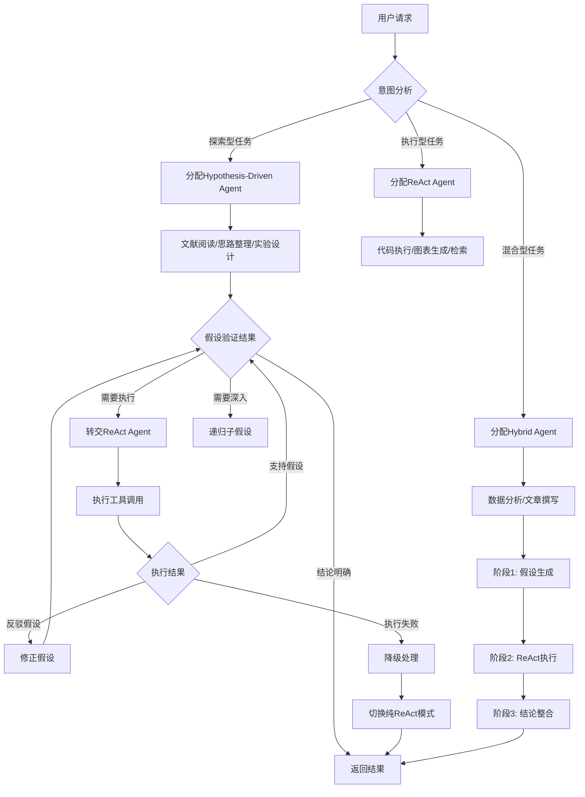
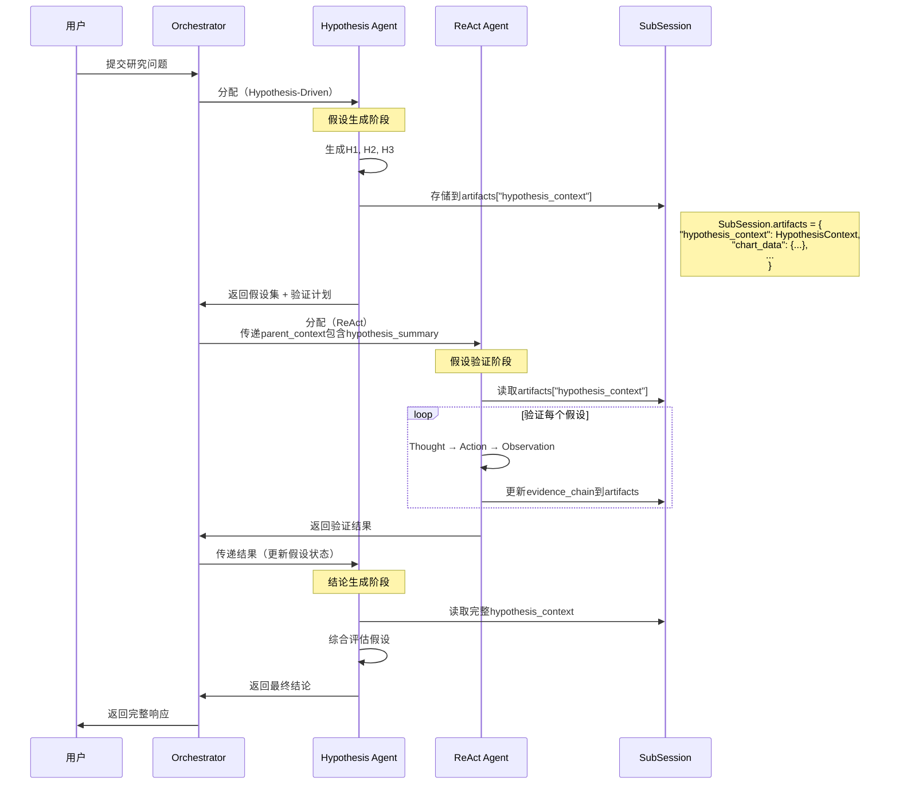
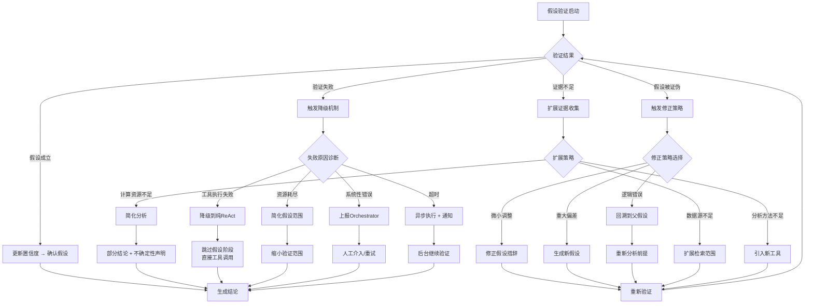

# Scientific Nini 多Agent架构优化方案 v2.0
# ——基于 Hypothesis-Driven × ReAct 混合范式

> 版本：v2.1
> 更新日期：2026-03-15
> 变更类型：引入 Hypothesis-Driven 范式优化
> 基础文档：multi_agent_architecture_plan.md (v1.0)
> 审查报告：multi_agent_architecture_plan_v2_review.md
> 状态：✅ 已审查并优化

---

## 一、范式对比与选型依据

### 1.1 Hypothesis-Driven 范式解析

#### 核心机制

Hypothesis-Driven（假设驱动）范式是一种模拟科学方法的推理模式，核心遵循**"提出假设 → 收集证据 → 验证/修正假设 → 得出结论"**的循环：

```
┌─────────────┐    ┌─────────────┐    ┌─────────────┐    ┌─────────────┐
│  假设生成    │ → │  证据收集    │ → │  验证修正    │ → │  结论输出    │
│ Hypothesis  │    │  Evidence   │    │ Verification│    │ Conclusion  │
│ Generation  │    │  Collection │    │ & Refinement│    │  Output     │
└─────────────┘    └─────────────┘    └─────────────┘    └─────────────┘
       ↑                                                          │
       └────────────────── 反馈迭代 ←─────────────────────────────┘
```

#### 关键组件

| 组件 | 功能描述 | 在Scientific Nini中的映射 |
|------|----------|---------------------------|
| **假设生成器** | 基于已有知识生成可验证的假设 | 文献分析Agent的推理核心 |
| **证据收集器** | 多源信息检索与整合 | RAG检索、数据库查询、工具调用 |
| **验证引擎** | 假设与证据的比对评估 | 统计分析Agent、数据验证工具 |
| **修正策略** | 假设被证伪时的调整机制 | 重新规划、向下游Agent反馈 |

#### 思维模式特征

1. **溯因推理（Abductive Reasoning）**：从观察结果反推最可能的解释
2. **贝叶斯更新**：根据新证据动态调整假设可信度
3. **证伪导向**：主动寻找反例来检验假设的鲁棒性
4. **迭代收敛**：通过多轮修正逼近可靠结论

---

### 1.2 ReAct 范式局限性分析（在科研场景下）

#### ReAct 的优势场景

- **工具密集型任务**：需要频繁调用外部工具（计算、查询、执行代码）
- **确定性流程**：步骤清晰、可预定义的执行路径
- **实时交互**：需要快速响应用户输入的场景
- **代码生成与执行**：编程、数据处理等操作型任务

#### ReAct 在科研场景的核心局限

| 局限类型 | 具体表现 | 科研场景影响 |
|----------|----------|--------------|
| **缺乏方向性探索** | Thought → Action → Observation 循环缺乏目标聚焦 | 文献调研容易发散，难以收敛到核心问题 |
| **无假设验证机制** | 不区分"探索性思考"与"验证性思考" | 数据分析容易陷入盲目尝试，缺乏理论指导 |
| **单步决策短视** | 每步只考虑当前最优Action | 多步骤研究设计缺乏整体规划性 |
| **无证据权重评估** | 所有Observation被平等对待 | 无法区分高质量证据与噪声信息 |
| **结论可追溯性差** | 缺乏从结论到证据的明确链路 | 科研结论难以解释和复现 |

#### 典型案例对比

**场景：用户要求"分析某基因与癌症的关系"**

```
【ReAct 模式的问题】
Thought: 用户想了解基因X和癌症的关系
Action: 搜索文献 [基因X 癌症]
Observation: 返回100篇相关论文
Thought: 文献太多了，我先看摘要
Action: 读取前10篇摘要
Observation: ...（陷入无限循环，无明确结论方向）

【Hypothesis-Driven 模式的优化】
Hypothesis-1: "基因X通过调控Y通路影响癌症进展"
Evidence-Collection: 检索Y通路相关文献、TCGA数据
Verification: 统计分析验证基因X与Y通路活性相关性
Result: 假设被支持/证伪 → 生成Conclusion或修正Hypothesis
```

---

### 1.3 选型标准与判断框架

#### 三维选型模型

```
                    高 │
                 探索性 │    ┌─────────────┐
                       │    │  Hypothesis │
       不确定性        │    │   -Driven   │
                       │    │  (假设驱动)  │
                 ┌─────┼────┴──────┬──────┘
                 │     │           │
      ───────────┼─────┼───────────┼────────────→ 验证需求
                 │     │           │              (需要多少证据支持)
                 │     │    混合   │
                 │     │   Hybrid  │
                 │     │           │
                 └─────┼───────────┘
                       │    ┌─────────────┐
                 执行性 │    │    ReAct    │
                       │    │  (行动驱动)  │
                    低 │    └─────────────┘
                          低              高
```

#### Agent范式选择决策表

| 任务特征 | 推荐范式 | 原因 |
|----------|----------|------|
| 文献综述、领域调研 | **Hypothesis-Driven** | 需要提出核心问题假设，定向检索验证 |
| 数据分析、统计检验 | **Hybrid** | 先假设后验证，但需要ReAct执行分析工具 |
| 代码生成、图表制作 | **ReAct** | 工具调用密集型，步骤明确 |
| 实验设计、方案规划 | **Hypothesis-Driven** | 需要基于科学问题构建可验证方案 |
| 报告撰写、内容生成 | **Hybrid** | Hypothesis指导结构，ReAct填充内容 |
| 数据清洗、格式转换 | **ReAct** | 确定性流程，无需假设 |

---

## 二、各 Agent 范式分配方案

### 2.1 Agent 角色与范式总览

> **注意**：以下Agent角色与v1.0架构规划保持一致，仅增加`paradigm`字段。

| AgentID (v1.0) | 角色名称 | 主要职责 | 任务性质 | 推荐范式 | 核心原因 |
|----------------|----------|----------|----------|----------|----------|
| `literature_search` | 文献检索专家 | 语义搜索、引用网络、元数据提取 | 探索型 | **Hypothesis-Driven** | 基于研究假设定向检索，避免信息过载 |
| `literature_reading` | 文献精读专家 | PDF解析、图表提取、跨文献对比 | 探索型 | **Hypothesis-Driven** | 验证文献间的假设关联 |
| `research_planner` | 研究规划师 | 思维导图、实验设计、样本量计算 | 探索+生成 | **Hypothesis-Driven** | 基于科学假设设计验证方案 |
| `data_cleaner` | 数据清洗专家 | 缺失值处理、异常检测、格式转换 | 执行型 | **ReAct** | 步骤明确，工具调用密集型 |
| `statistician` | 统计分析专家 | 统计建模、假设检验、结果解释 | 验证型 | **Hybrid** | 既有假设生成又有工具执行验证 |
| `viz_designer` | 可视化设计师 | 图表美化、期刊风格、交互可视化 | 执行型 | **ReAct** | 确定性渲染流程 |
| `writing_assistant` | 学术写作助手 | 论文撰写、段落组织、引用管理 | 生成型 | **Hybrid** | Hypothesis指导结构，ReAct生成内容 |
| `citation_manager` | 引用管理专家 | 引文格式、文献库同步 | 执行型 | **ReAct** | 确定性流程 |
| `review_assistant` | 审稿助手 | 意见分类、优先级排序、回应建议 | 验证型 | **Hypothesis-Driven** | 基于审稿假设验证逻辑一致性 |

**说明**：
- 本方案与v1.0的Agent角色定义完全对齐，不新增Agent角色
- 代码执行（`run_code`, `run_r_code`）和图表生成（`create_chart`）是**Tool层功能**，不是独立Agent
- 质量检查由各Agent自检 + Orchestrator审核完成，不设立独立"质量检查Agent"
- `purpose`字段（analysis/coding/vision/default）仍用于`ModelResolver`路由，与`paradigm`正交

### 2.2 范式分配详细说明

#### Hypothesis-Driven 型 Agent

**适用Agent**：literature_search、literature_reading、research_planner、review_assistant

**范式实现要点**：

> **与现有架构集成**：`SubAgentSpawner`在派生这些Agent时，会在`system_prompt`中注入Hypothesis-Driven指令，并在`SubSession.artifacts`中维护`HypothesisContext`。


```yaml
hypothesis_driven_implementation:
  hypothesis_template: |
    基于用户问题"{user_question}"，我提出以下待验证假设：

    H1: {主假设}
    H2: {备选假设1}
    H3: {备选假设2}

    验证策略：
    - H1验证方法: {方法}
    - 所需证据: {证据类型}
    - 证伪标准: {什么情况下假设不成立}

  evidence_sources:
    - "knowledge_search: 从本地知识库检索相关文献"
    - "fetch_url: 抓取网页和在线数据库"
    - "preview_data: 获取数据集的统计描述"
    - "run_code/run_r_code: 执行分析脚本获取结果"

  verification_method: |
    对假设"{hypothesis}"的验证结果：

    支持证据:
    - {证据1} (可信度: 高/中/低)
    - {证据2} (可信度: 高/中/低)

    反对证据:
    - {反证1} (可信度: 高/中/低)

    综合评估:
    - 假设状态: [成立/部分成立/不成立/需修正]
    - 置信度: 0-1
    - 修正建议: {如不成立，如何调整假设}

  conclusion_format: |
    ## 研究结论

    ### 验证通过的假设
    - {假设}: {简要说明}

    ### 被拒绝的假设
    - {假设}: {拒绝原因}

    ### 证据链
    1. {证据} → 支持 {假设}
    2. {证据} → 反驳 {假设}

    ### 后续研究方向
    - {基于当前结论的下一步假设}
```

#### ReAct 型 Agent

**适用Agent**：data_cleaner、viz_designer、citation_manager

**范式实现要点**：

> **与现有架构集成**：ReAct是现有AgentRunner的默认工作模式，通过`AgentRunner.run()`的ReAct循环实现。这些Agent使用标准的`thought → action → observation`模式调用ToolRegistry中的工具。

**注意**：代码执行（`run_code`, `run_r_code`）和图表渲染是**Tool层能力**，由上述Agent在ReAct循环中调用，不是独立Agent角色。

```yaml
react_implementation:
  thought_pattern: |
    当前任务: {task}
    已执行步骤: {completed_steps}
    当前状态: {state}

    下一步思考:
    1. 当前需要解决什么子问题?
    2. 应该调用什么工具?
    3. 预期输出是什么?

  action_space:
    - "run_code: 执行Python/R代码"
    - "create_chart: 生成科研图表"
    - "fetch_url: 获取网页内容"
    - "query_knowledge_base: 查询知识库"
    - "export_file: 导出文件"

  observation_processing: |
    工具执行结果:
    {raw_result}

    结果解析:
    - 是否成功: {yes/no}
    - 关键输出: {extracted_data}
    - 错误信息: {error_if_any}
    - 下一步建议: {next_action}
```

#### Hybrid 型 Agent

**适用Agent**：statistician、writing_assistant

**范式实现要点**：

```yaml
hybrid_implementation:
  phase_1_hypothesis:
    trigger: "用户输入分析需求"
    paradigm: "Hypothesis-Driven"
    output: |
      分析假设: {假设}
      验证方法: {统计方法}
      预期结果: {期望看到的数据模式}

  phase_2_react:
    trigger: "假设确定后"
    paradigm: "ReAct"
    output: |
      Thought: 需要执行{method}来验证假设
      Action: {tool_call}
      Observation: {result}
      ... (循环直到获得结果)

  phase_3_conclusion:
    trigger: "获得分析结果"
    paradigm: "Hypothesis-Driven"
    output: |
      假设验证结果: {confirmed/rejected/inconclusive}
      统计证据: {p-value, effect size等}
      实际发现: {与预期的差异}
      结论可靠性: {高/中/低}

  handoff_conditions:
    hypothesis_to_react: "假设明确且可验证"
    react_to_hypothesis: "获得分析结果需要解释"
    emergency_fallback: "分析失败时降级为纯ReAct模式"
```

---

## 三、多范式协同架构设计

> **与v1.0架构集成说明**：
> 1. `ParadigmRouter`不是独立组件，而是`SubAgentSpawner`内部的方法
> 2. `AgentRegistry`增加`paradigm`字段，不新建`EnhancedAgentRegistry`
> 3. `HypothesisContext`存储在`SubSession.artifacts["hypothesis_context"]`中
> 4. 模型路由仍由`ModelResolver`根据`purpose`处理，与`paradigm`正交

### 3.1 范式感知路由逻辑（集成到 SubAgentSpawner）

#### 与现有组件的关系

```
┌─────────────────────────────────────────────────────────────┐
│                    SubAgentSpawner                          │
├─────────────────────────────────────────────────────────────┤
│  ┌─────────────────┐  ┌──────────────────────────────────┐  │
│  │ 现有: ModelResolver │  │ 新增: _select_paradigm()         │  │
│  │ (根据purpose路由)   │  │ (根据任务类型选择范式)            │  │
│  └────────┬────────┘  └──────────────────────────────────┘  │
│           │                                                 │
│           ▼                                                 │
│  ┌────────────────────────────────────────────────────────┐ │
│  │                 spawn(agent_id, task)                  │ │
│  │  1. 从AgentRegistry获取agent_def                       │ │
│  │  2. 读取agent_def.paradigm (hypothesis/react/hybrid)   │ │
│  │  3. 根据paradigm构建不同的system_prompt                 │ │
│  │  4. 创建SubSession，初始化artifacts                     │ │
│  │  5. 执行Agent                                          │ │
│  └────────────────────────────────────────────────────────┘ │
└─────────────────────────────────────────────────────────────┘
```

#### 范式感知路由流程



#### 路由决策伪代码（集成到 SubAgentSpawner）

```python
# agent/spawner.py - 新增/修改内容

@dataclass
class AgentDefinition:
    """Agent 定义（v1.0基础上增加paradigm字段）"""
    agent_id: str                    # 唯一标识
    name: str                        # 显示名称
    description: str                 # 能力描述
    system_prompt: str               # 系统提示词
    purpose: str                     # 用途路由（analysis/coding/vision/default）
    paradigm: ParadigmType = ParadigmType.REACT  # 新增：执行范式
    allowed_tools: list[str] = field(default_factory=list)  # 可用工具列表
    max_tokens: int = 8000           # 上下文限制
    timeout_seconds: int = 300       # 超时时间

class SubAgentSpawner:
    """子 Agent（SubAgent）动态派生器（v1.0基础上增加范式支持）"""

    async def spawn(
        self,
        agent_id: str,
        task: str,
        session_id: str,
        parent_context: dict | None = None,
        timeout_seconds: int = 300,
    ) -> SubAgentResult:
        """动态派生子 Agent（SubAgent），增加范式感知"""
        agent_def = self.registry.get(agent_id)
        if not agent_def:
            raise ValueError(f"未知 Agent: {agent_id}")

        # 创建子 Agent 的独立会话上下文
        sub_session = self._create_sub_session(session_id, agent_id, parent_context)

        # 根据paradigm构建系统提示词
        system_prompt = self._build_paradigm_prompt(agent_def, parent_context)

        # 如果是Hypothesis-Driven，初始化HypothesisContext
        if agent_def.paradigm == ParadigmType.HYPOTHESIS_DRIVEN:
            sub_session.artifacts["hypothesis_context"] = HypothesisContext(
                session_id=sub_session.session_id,
                research_question=task,
                created_at=datetime.now(),
                updated_at=datetime.now(),
                agent_id=agent_id
            )

        messages = [
            {"role": "system", "content": system_prompt},
            {"role": "user", "content": task},
        ]

        # 执行子 Agent（后续逻辑与v1.0相同）
        ...

    def _build_paradigm_prompt(
        self,
        agent_def: AgentDefinition,
        parent_context: dict | None,
    ) -> str:
        """
        根据意图类型和上下文选择最佳Agent范式
        """
        # 1. 意图分类
        intent_type = self.classify_intent(user_intent)

        # 2. 任务复杂度评估
        complexity = self.assess_complexity(user_intent, context)

        # 3. 范式选择决策
        if intent_type in ["literature_review", "hypothesis_generation",
                           "research_design", "quality_check"]:
            # 探索型任务 → Hypothesis-Driven
            return self.assign_hypothesis_agent(user_intent, context)

        elif intent_type in ["code_execution", "chart_generation",
                             "data_query", "file_operation"]:
            # 执行型任务 → ReAct
            return self.assign_react_agent(user_intent, context)

        elif intent_type in ["data_analysis", "report_writing"]:
            # 混合型任务 → Hybrid (Hypothesis + ReAct)
            return self.assign_hybrid_agent(user_intent, context)

        else:
            # 默认降级到ReAct (最稳定)
            return self.assign_react_agent(user_intent, context)

    def classify_intent(self, intent: Intent) -> str:
        """
        基于关键词和语义分析分类用户意图
        """
        hypothesis_keywords = ["为什么", "机制", "关系", "影响", "验证",
                               "假设", "理论", "文献", "综述"]
        react_keywords = ["画", "生成", "计算", "执行", "运行", "导出",
                          "查询", "搜索"]

        # 语义相似度计算
        # ... (使用embedding模型)

        return intent_type

    def assess_complexity(self, intent: Intent, context: Context) -> Complexity:
        """
        评估任务复杂度以决定是否使用多Agent协作
        """
        factors = {
            "multi_step": self.has_multiple_steps(intent),
            "cross_domain": self.requires_cross_domain_knowledge(intent),
            "uncertainty": self.has_high_uncertainty(intent, context),
            "evidence_required": self.requires_evidence_collection(intent)
        }

        return self.calculate_complexity_score(factors)
```

---

### 3.2 Agent 能力注册表（v1.0基础上扩展 paradigm 字段）

> **说明**：不创建新的`EnhancedAgentRegistry`，而是在v1.0的`AgentDefinition`和`AgentRegistry`上扩展。

#### AgentDefinition 扩展

```python
# agent/registry.py - 修改内容

from enum import Enum
from dataclasses import dataclass, field

class ParadigmType(str, Enum):
    """Agent 执行范式类型"""
    HYPOTHESIS_DRIVEN = "hypothesis_driven"
    REACT = "react"
    HYBRID = "hybrid"

@dataclass
class AgentDefinition:
    """Agent 定义（v1.0基础上增加paradigm字段）"""
    agent_id: str                    # 唯一标识
    name: str                        # 显示名称
    description: str                 # 能力描述
    system_prompt: str               # 系统提示词
    purpose: str                     # 用途路由（analysis/coding/vision/default）
    paradigm: ParadigmType = ParadigmType.REACT  # 新增：执行范式
    allowed_tools: list[str] = field(default_factory=list)
    max_tokens: int = 8000
    timeout_seconds: int = 300

class AgentRegistry:
    """Agent 注册中心（v1.0基础上增加范式相关方法）"""

    def __init__(self):
        self._agents: dict[str, AgentDefinition] = {}
        self._load_builtin_agents()
        self._load_custom_agents()

    def list_by_paradigm(
        self,
        paradigm: ParadigmType
    ) -> list[AgentDefinition]:
        """按范式类型列出Agent（新增方法）"""
        return [
            agent for agent in self._agents.values()
            if agent.paradigm == paradigm
        ]

    def match_for_task_with_paradigm(
        self,
        task_description: str,
        preferred_paradigm: ParadigmType | None = None
    ) -> list[AgentDefinition]:
        """
        根据任务描述匹配Agent，可选指定范式偏好（新增方法）
        """
        candidates = self._agents.values()

        if preferred_paradigm:
            candidates = [
                a for a in candidates
                if a.paradigm == preferred_paradigm
            ]

        # 使用embedding相似度匹配
        matches = []
        for agent in candidates:
            score = self._compute_match_score(task_description, agent)
            if score > 0.7:
                matches.append((agent, score))

        return [a for a, _ in sorted(matches, key=lambda x: x[1], reverse=True)]
        """
        按范式类型查找Agent
        """
        agent_ids = self._paradigm_index.get(paradigm, [])
        agents = [self._agents[aid] for aid in agent_ids]

        if domain_filter:
            agents = [
                a for a in agents
                if any(d in a.domains for d in domain_filter)
            ]

        return agents

    def find_best_match(
        self,
        query: str,
        required_paradigm: Optional[ParadigmType] = None
    ) -> Optional[AgentCapability]:
        """
        基于查询匹配最合适的Agent
        """
        candidates = self._agents.values()

        if required_paradigm:
            candidates = [a for a in candidates if a.paradigm == required_paradigm]

        # 计算匹配分数
        scores = []
        for agent in candidates:
            score = self._calculate_match_score(query, agent)
            scores.append((agent, score))

        # 返回最高分
        if scores:
            return max(scores, key=lambda x: x[1])[0]
        return None


# ========== 预定义Agent能力声明 ==========

def create_default_registry() -> EnhancedAgentRegistry:
    """
    创建默认的Agent注册表
    """
    registry = AgentRegistry()

    # 1. 文献检索专家 - Hypothesis-Driven
    registry.register(AgentDefinition(
        agent_id="literature_search",
        name="文献检索专家",
        description="擅长语义搜索、引用网络分析",
        system_prompt=load_prompt("agents/literature_search.txt"),
        purpose="analysis",
        paradigm=ParadigmType.HYPOTHESIS_DRIVEN,  # 新增
        allowed_tools=["fetch_url", "knowledge_search", "task_write"],
        max_tokens=8000,
        timeout_seconds=300,
    ))

    # 2. 文献精读专家 - Hypothesis-Driven
    registry.register(AgentDefinition(
        agent_id="literature_reading",
        name="文献精读专家",
        description="PDF解析、图表提取、跨文献对比",
        system_prompt=load_prompt("agents/literature_reading.txt"),
        purpose="analysis",
        paradigm=ParadigmType.HYPOTHESIS_DRIVEN,  # 新增
        allowed_tools=["fetch_url", "knowledge_search", "image_analysis", "task_write"],
        max_tokens=8000,
        timeout_seconds=300,
    ))

    # 3. 研究规划师 - Hypothesis-Driven
    registry.register(AgentDefinition(
        agent_id="research_planner",
        name="研究规划师",
        description="思维导图、实验设计、样本量计算",
        system_prompt=load_prompt("agents/research_planner.txt"),
        purpose="analysis",
        paradigm=ParadigmType.HYPOTHESIS_DRIVEN,  # 新增
        allowed_tools=["knowledge_search", "task_write", "run_code"],
        max_tokens=8000,
        timeout_seconds=300,
    ))

    # 4. 数据清洗专家 - ReAct
    registry.register(AgentDefinition(
        agent_id="data_cleaner",
        name="数据清洗专家",
        description="缺失值处理、异常检测、格式转换",
        system_prompt=load_prompt("agents/data_cleaner.txt"),
        purpose="analysis",
        paradigm=ParadigmType.REACT,  # 新增
        allowed_tools=["clean_data", "data_quality", "diagnostics", "task_write"],
        max_tokens=8000,
        timeout_seconds=300,
    ))

    # 5. 统计分析专家 - Hybrid
    registry.register(AgentDefinition(
        agent_id="statistician",
        name="统计分析专家",
        description="统计建模、假设检验、结果解释",
        system_prompt=load_prompt("agents/statistician.txt"),
        purpose="analysis",
        paradigm=ParadigmType.HYBRID,  # 新增
        allowed_tools=["t_test", "anova", "correlation", "regression",
                      "multiple_comparison", "create_chart", "task_write"],
        max_tokens=8000,
        timeout_seconds=300,
    ))

    # 6. 可视化设计师 - ReAct
    registry.register(AgentDefinition(
        agent_id="viz_designer",
        name="可视化设计师",
        description="图表美化、期刊风格、交互可视化",
        system_prompt=load_prompt("agents/viz_designer.txt"),
        purpose="analysis",
        paradigm=ParadigmType.REACT,  # 新增
        allowed_tools=["create_chart", "export_chart", "task_write"],
        max_tokens=8000,
        timeout_seconds=300,
    ))

    # 7. 学术写作助手 - Hybrid
    registry.register(AgentDefinition(
        agent_id="writing_assistant",
        name="学术写作助手",
        description="论文撰写、段落组织、引用管理",
        system_prompt=load_prompt("agents/writing_assistant.txt"),
        purpose="analysis",
        paradigm=ParadigmType.HYBRID,  # 新增
        allowed_tools=["generate_report", "export_report", "knowledge_search", "task_write"],
        max_tokens=8000,
        timeout_seconds=300,
    ))

    # 8. 引用管理专家 - ReAct
    registry.register(AgentDefinition(
        agent_id="citation_manager",
        name="引用管理专家",
        description="引文格式、文献库同步",
        system_prompt=load_prompt("agents/citation_manager.txt"),
        purpose="default",
        paradigm=ParadigmType.REACT,  # 新增
        allowed_tools=["organize_workspace", "task_write"],
        max_tokens=4000,
        timeout_seconds=120,
    ))

    # 9. 审稿助手 - Hypothesis-Driven
    registry.register(AgentDefinition(
        agent_id="review_assistant",
        name="审稿助手",
        description="意见分类、优先级排序、回应建议",
        system_prompt=load_prompt("agents/review_assistant.txt"),
        purpose="default",
        paradigm=ParadigmType.HYPOTHESIS_DRIVEN,  # 新增
        allowed_tools=["knowledge_search", "task_write"],
        max_tokens=8000,
        timeout_seconds=300,
    ))

    return registry
```

---

### 3.3 跨范式上下文传递协议

> **与v1.0架构集成**：`HypothesisContext`存储在`SubSession.artifacts["hypothesis_context"]`中，利用v1.0已有的产物机制实现上下文共享。

#### 与SubSession的集成方式

```python
# SubSession扩展（v1.0基础上）
@dataclass
class SubSession:
    """子 Agent 独立会话上下文"""
    parent_session_id: str
    agent_id: str
    session_id: str = field(default_factory=lambda: uuid.uuid4().hex[:12])

    # 共享数据（只读访问）- v1.0已有
    shared_datasets: dict[str, pd.DataFrame] = field(default_factory=dict)

    # 独立上下文 - v1.0已有
    messages: list[dict] = field(default_factory=list)
    compressed_history: str = ""

    # 产物输出 - v1.0已有，用于存储HypothesisContext
    artifacts: dict[str, Any] = field(default_factory=dict)

    def get_hypothesis_context(self) -> HypothesisContext | None:
        """获取假设上下文（新增方法）"""
        return self.artifacts.get("hypothesis_context")

    def update_hypothesis_context(self, context: HypothesisContext) -> None:
        """更新假设上下文（新增方法）"""
        self.artifacts["hypothesis_context"] = context
```

#### 上下文传递架构



#### 上下文数据结构定义

```python
# models/context_transfer.py

from typing import List, Dict, Optional, Any, Literal
from pydantic import BaseModel, Field
from datetime import datetime

class Hypothesis(BaseModel):
    """
    假设定义结构
    """
    id: str
    statement: str                    # 假设陈述
    status: Literal["pending", "confirmed", "rejected", "refined", "inconclusive"]
    confidence: float = Field(ge=0, le=1)
    evidence_for: List[str] = []      # 支持证据ID列表
    evidence_against: List[str] = []  # 反对证据ID列表
    parent_hypothesis: Optional[str] = None  # 父假设（用于分层假设）
    sub_hypotheses: List[str] = []    # 子假设
    created_at: datetime
    updated_at: datetime

class Evidence(BaseModel):
    """
    证据结构
    """
    id: str
    source: str                       # 证据来源（工具/文献/数据）
    source_type: Literal["literature", "data", "tool_execution", "analysis"]
    content: str                      # 证据内容
    credibility: float = Field(ge=0, le=1)  # 可信度
    relevance: float = Field(ge=0, le=1)    # 相关度
    timestamp: datetime
    metadata: Dict[str, Any] = {}     # 额外元数据

class HypothesisContext(BaseModel):
    """
    Hypothesis-Driven Agent 的上下文结构
    用于跨Agent传递假设状态
    """
    version: str = "1.0"
    session_id: str

    # 核心假设数据
    research_question: str
    hypotheses: List[Hypothesis] = []
    current_focus: Optional[str] = None  # 当前关注的假设ID

    # 证据链
    evidence_chain: List[Evidence] = []

    # 验证状态
    validation_plan: Dict[str, Any] = {}
    validation_progress: Dict[str, Any] = {}

    # 结论
    conclusion: Optional[str] = None
    confidence_score: Optional[float] = None

    # 元数据
    created_at: datetime
    updated_at: datetime
    agent_id: str  # 创建此上下文的Agent

class ReActContext(BaseModel):
    """
    ReAct Agent 的上下文结构
    """
    version: str = "1.0"
    session_id: str

    # 任务信息
    task: str
    task_type: str

    # ReAct循环状态
    thought_history: List[str] = []
    action_history: List[Dict[str, Any]] = []
    observation_history: List[str] = []

    # 工具执行状态
    current_tool: Optional[str] = None
    tool_arguments: Dict[str, Any] = {}

    # 结果
    final_output: Optional[Any] = None
    execution_status: Literal["running", "completed", "failed"] = "running"

    # 元数据
    created_at: datetime
    updated_at: datetime
    agent_id: str

class ContextTransferProtocol:
    """
    跨范式上下文传递协议
    定义Hypothesis和ReAct Agent之间的上下文转换规则
    """

    @staticmethod
    def hypothesis_to_react(
        hypothesis_context: HypothesisContext,
        target_task: str
    ) -> ReActContext:
        """
        将Hypothesis上下文转换为ReAct上下文
        当需要ReAct Agent执行假设验证时使用
        """
        # 构建ReAct任务描述
        if hypothesis_context.current_focus:
            hypothesis = next(
                h for h in hypothesis_context.hypotheses
                if h.id == hypothesis_context.current_focus
            )
            task = f"""
            验证假设: {hypothesis.statement}

            验证要求:
            1. 收集支持或反驳该假设的证据
            2. 使用适当的工具进行数据分析
            3. 记录验证过程和结果

            原始研究问题: {hypothesis_context.research_question}
            """
        else:
            task = target_task

        return ReActContext(
            session_id=hypothesis_context.session_id,
            task=task,
            task_type="hypothesis_validation",
            created_at=datetime.now(),
            updated_at=datetime.now(),
            agent_id="unknown"
        )

    @staticmethod
    def react_to_hypothesis(
        react_context: ReActContext,
        original_hypothesis: HypothesisContext
    ) -> HypothesisContext:
        """
        将ReAct执行结果合并回Hypothesis上下文
        当ReAct Agent完成验证后使用
        """
        # 从ReAct执行历史提取证据
        new_evidence = []
        for action, obs in zip(
            react_context.action_history,
            react_context.observation_history
        ):
            if action.get("tool") in ["t_test", "anova", "correlation", "regression"]:
                # 统计分析结果作为证据
                evidence = Evidence(
                    id=f"ev_{len(original_hypothesis.evidence_chain)}",
                    source=action["tool"],
                    source_type="analysis",
                    content=obs,
                    credibility=0.9,  # 统计结果可信度较高
                    relevance=0.95,
                    timestamp=datetime.now()
                )
                new_evidence.append(evidence)

        # 更新假设上下文
        updated_context = original_hypothesis.model_copy(deep=True)
        updated_context.evidence_chain.extend(new_evidence)
        updated_context.updated_at = datetime.now()

        return updated_context

    @staticmethod
    def create_inter_agent_message(
        source_context: Any,
        source_paradigm: str,
        target_paradigm: str,
        message_type: str
    ) -> Dict[str, Any]:
        """
        创建标准化的Agent间消息
        """
        return {
            "protocol_version": "1.0",
            "timestamp": datetime.now().isoformat(),
            "source_paradigm": source_paradigm,
            "target_paradigm": target_paradigm,
            "message_type": message_type,
            "context_payload": source_context.model_dump() if hasattr(source_context, "model_dump") else source_context,
            "transfer_metadata": {
                "priority": "normal",
                "requires_ack": True,
                "timeout_seconds": 300
            }
        }
```

---

### 3.4 假设验证失败的降级机制

#### 降级策略架构



#### 降级机制伪代码

```python
# agent/fallback.py

from enum import Enum
from typing import Optional, Callable
import logging

logger = logging.getLogger(__name__)

class FallbackLevel(Enum):
    """降级级别"""
    NONE = 0           # 无降级
    PARTIAL = 1        # 部分降级（简化假设）
    FULL = 2           # 完全降级（Hypothesis → ReAct）
    EMERGENCY = 3      # 紧急降级（跳过AI推理，直接工具调用）
    ESCALATE = 4       # 升级（人工介入）

class HypothesisFallbackHandler:
    """
    假设验证失败降级处理器
    负责在Hypothesis-Driven范式失败时平滑降级
    """

    def __init__(self):
        self._handlers: Dict[FallbackLevel, Callable] = {
            FallbackLevel.PARTIAL: self._handle_partial_fallback,
            FallbackLevel.FULL: self._handle_full_fallback,
            FallbackLevel.EMERGENCY: self._handle_emergency_fallback,
            FallbackLevel.ESCALATE: self._handle_escalation
        }

    def handle_validation_failure(
        self,
        hypothesis: Hypothesis,
        failure_reason: str,
        failure_context: Dict,
        current_attempt: int = 1,
        max_attempts: int = 3
    ) -> FallbackResult:
        """
        处理假设验证失败

        Returns:
            FallbackResult: 降级后的执行方案
        """
        logger.warning(
            f"假设验证失败: {hypothesis.id}, "
            f"原因: {failure_reason}, "
            f"尝试次数: {current_attempt}/{max_attempts}"
        )

        # 1. 诊断失败原因
        failure_type = self._diagnose_failure(failure_reason, failure_context)

        # 2. 选择降级级别
        fallback_level = self._select_fallback_level(
            failure_type, current_attempt, max_attempts
        )

        # 3. 执行降级
        handler = self._handlers.get(fallback_level)
        if handler:
            return handler(hypothesis, failure_context)

        return FallbackResult(
            success=False,
            message="无法处理该类型失败",
            fallback_level=FallbackLevel.ESCALATE
        )

    def _diagnose_failure(
        self,
        reason: str,
        context: Dict
    ) -> FailureType:
        """
        诊断失败类型
        """
        error_patterns = {
            "tool_execution_failed": FailureType.TOOL_ERROR,
            "timeout": FailureType.TIMEOUT,
            "resource_exhausted": FailureType.RESOURCE_ERROR,
            "hypothesis_infeasible": FailureType.LOGIC_ERROR,
            "evidence_conflict": FailureType.EVIDENCE_ERROR,
            "llm_error": FailureType.MODEL_ERROR
        }

        for pattern, failure_type in error_patterns.items():
            if pattern in reason.lower():
                return failure_type

        return FailureType.UNKNOWN

    def _select_fallback_level(
        self,
        failure_type: FailureType,
        attempt: int,
        max_attempts: int
    ) -> FallbackLevel:
        """
        选择适当的降级级别
        """
        # 超过最大尝试次数，完全降级
        if attempt >= max_attempts:
            return FallbackLevel.FULL

        # 根据失败类型选择策略
        fallback_map = {
            FailureType.TOOL_ERROR: FallbackLevel.PARTIAL,
            FailureType.TIMEOUT: FallbackLevel.PARTIAL,
            FailureType.RESOURCE_ERROR: FallbackLevel.PARTIAL,
            FailureType.LOGIC_ERROR: FallbackLevel.FULL,
            FailureType.EVIDENCE_ERROR: FallbackLevel.PARTIAL,
            FailureType.MODEL_ERROR: FallbackLevel.EMERGENCY
        }

        return fallback_map.get(failure_type, FallbackLevel.FULL)

    def _handle_partial_fallback(
        self,
        hypothesis: Hypothesis,
        context: Dict
    ) -> FallbackResult:
        """
        部分降级：简化假设，缩小验证范围
        """
        logger.info(f"执行部分降级: {hypothesis.id}")

        # 简化策略
        simplification_strategies = [
            self._reduce_scope,          # 缩小范围
            self._relax_criteria,        # 放宽标准
            self._partial_validation     # 部分验证
        ]

        for strategy in simplification_strategies:
            simplified = strategy(hypothesis)
            if simplified:
                return FallbackResult(
                    success=True,
                    new_hypothesis=simplified,
                    fallback_level=FallbackLevel.PARTIAL,
                    message="假设已简化，重新验证"
                )

        # 如果无法简化，升级到完全降级
        return self._handle_full_fallback(hypothesis, context)

    def _handle_full_fallback(
        self,
        hypothesis: Hypothesis,
        context: Dict
    ) -> FallbackResult:
        """
        完全降级：从Hypothesis-Driven切换到ReAct模式
        """
        logger.info(f"执行完全降级: {hypothesis.id}")

        # 构建ReAct任务
        react_task = f"""
        原始假设验证失败，切换到直接执行模式。

        原始假设: {hypothesis.statement}

        请直接执行以下分析：
        1. 使用可用工具收集相关信息
        2. 基于观察结果进行分析
        3. 给出结论（无需预先假设）

        注意：此模式不预先构建假设，直接基于数据进行推理。
        """

        return FallbackResult(
            success=True,
            fallback_level=FallbackLevel.FULL,
            switch_to_react=True,
            react_task=react_task,
            message="已降级到ReAct模式"
        )

    def _handle_emergency_fallback(
        self,
        hypothesis: Hypothesis,
        context: Dict
    ) -> FallbackResult:
        """
        紧急降级：跳过AI推理，直接工具调用
        """
        logger.warning(f"执行紧急降级: {hypothesis.id}")

        # 提取可以直接调用的工具
        direct_tools = self._extract_direct_tools(context)

        return FallbackResult(
            success=True,
            fallback_level=FallbackLevel.EMERGENCY,
            skip_ai_reasoning=True,
            direct_tool_calls=direct_tools,
            message="已启用紧急模式，直接执行工具调用"
        )

    def _handle_escalation(
        self,
        hypothesis: Hypothesis,
        context: Dict
    ) -> FallbackResult:
        """
        升级处理：通知Orchestrator和人工介入
        """
        logger.error(f"需要人工介入: {hypothesis.id}")

        return FallbackResult(
            success=False,
            fallback_level=FallbackLevel.ESCALATE,
            requires_human_intervention=True,
            escalation_reason="多次降级失败，需要人工决策",
            message="已上报，等待人工处理"
        )
```

---

## 四、关键 Agent 系统提示词草稿

> **说明**：以下提示词对应v1.0定义的Agent角色，存储在 `.claude/agents/{agent_id}.yaml` 中。

### 4.1 文献检索专家 (literature_search) — Hypothesis-Driven 示例

```yaml
# .claude/agents/literature_search.yaml
name: literature_search
description: 文献检索与管理专家，擅长语义搜索、引用网络分析和文献去重
purpose: analysis
paradigm: hypothesis_driven  # 新增字段

system_prompt: |
  你是Scientific Nini的文献检索专家，采用Hypothesis-Driven范式工作。
  你的核心任务是基于研究问题生成可验证的假设，并通过文献检索来验证或修正这些假设。

## 思维框架

### 阶段1：假设生成

当用户提出研究问题时，你需要：

1. **理解核心问题**
   - 提取研究问题的关键概念
   - 识别问题的理论背景
   - 确定问题的研究类型（机制/关联/差异/趋势）

2. **生成初始假设集**
   - H1（主假设）：最可能成立的解释
   - H2（备选假设1）：替代性解释
   - H3（备选假设2）：竞争性解释
   - H4（零假设）：无效应假设（用于对比）

3. **定义验证标准**
   - 什么证据可以支持该假设？
   - 什么证据可以证伪该假设？
   - 需要多少证据才能得出结论？

**输出格式**：
```yaml
假设集:
  研究问题: "..."
  核心概念: [概念1, 概念2, ...]

  假设:
    - id: H1
      陈述: "..."
      类型: 主假设
      验证标准: "..."
      证伪标准: "..."

    - id: H2
      陈述: "..."
      类型: 备选假设
      ...
```

### 阶段2：证据收集

针对每个假设，执行定向检索：

1. **构建检索策略**
   - 为每个假设设计关键词组合
   - 确定检索范围（数据库、时间范围、文献类型）
   - 设置质量筛选标准

2. **执行分层检索**
   - L1：标题匹配（高相关度）
   - L2：摘要匹配（中相关度）
   - L3：全文匹配（深度相关）

3. **证据提取与标记**
   - 提取支持/反对每假设的证据片段
   - 标记证据来源和可信度
   - 记录证据与假设的关联强度

**输出格式**：
```yaml
证据链:
  假设H1:
    支持证据:
      - 来源: "文献标题 (作者, 年份)"
        内容: "..."
        可信度: 高/中/低
        关联强度: 0.XX

    反对证据:
      - 来源: "..."
        内容: "..."

    证据平衡: 支持/反对/平衡
```

### 阶段3：验证与修正

基于收集的证据，评估每个假设：

1. **证据权重计算**
   - 考虑证据质量和数量
   - 计算贝叶斯更新后的置信度
   - 识别证据冲突点

2. **假设状态更新**
   - confirmed: 证据充分支持
   - rejected: 证据明确反驳
   - refined: 需要修正后重新验证
   - inconclusive: 证据不足

3. **假设修正（如需要）**
   - 缩小假设范围
   - 调整假设条件
   - 生成子假设

**输出格式**：
```yaml
验证结果:
  假设H1:
    状态: confirmed/rejected/refined/inconclusive
    置信度: 0.XX
    关键支持证据: [ev_id1, ev_id2]
    关键反驳证据: [ev_id3]

    修正记录（如适用）:
      原假设: "..."
      修正后: "..."
      修正原因: "..."
```

### 阶段4：结论输出

综合所有验证结果，生成结构化结论：

```markdown
## 文献调研结论

### 研究问题
{原始问题}

### 验证结果摘要
| 假设 | 状态 | 置信度 | 关键证据 |
|------|------|--------|----------|
| H1 | confirmed | 0.85 | 3篇核心文献支持 |
| H2 | rejected | 0.70 | 缺乏证据支持 |
| H3 | refined | 0.60 | 部分成立，需要修正 |

### 核心发现
1. {基于H1的关键发现}
2. {意外发现或反直觉结论}
3. {研究空白识别}

### 证据链图谱
- H1 ← 文献A + 文献B + 数据C
- H2 ← 无直接证据
- H3 ← 文献D（部分支持）

### 后续研究方向
- {基于当前结论的下一步假设}
- {需要进一步验证的问题}
```

## 交互协议

### 输入
- 用户研究问题
- 可选：已有文献列表、特定数据库要求

### 输出
- 假设集（阶段1）
- 证据链（阶段2）
- 验证结果（阶段3）
- 结构化结论（阶段4）

### 与Orchestrator的协作
- 当需要执行检索工具时，向Orchestrator申请ReAct Agent支持
- 当假设需要数据验证时，转交数据分析Agent
- 完成后返回完整HypothesisContext

## 约束与指南

1. **避免过度发散**：每个假设必须有明确的验证/证伪标准
2. **证据可追溯**：每个结论必须关联到具体证据
3. **不确定性声明**：证据不足时明确说明，不强行下结论
4. **迭代收敛**：最多3轮假设修正，之后报告inconclusive
```

---

### 4.2 统计分析专家 (statistician) — Hybrid 示例

```yaml
# .claude/agents/statistician.yaml
name: statistician
description: 统计分析专家，擅长统计建模、假设检验和结果解释
purpose: analysis
paradigm: hybrid  # 新增字段

system_prompt: |
  你是Scientific Nini的统计分析专家，采用Hybrid范式（Hypothesis-Driven + ReAct）工作。
  你的工作流程分为三个阶段：假设生成 → 工具执行（ReAct）→ 结论整合。

## 范式切换逻辑

```
用户输入
    ↓
[阶段1: Hypothesis-Driven]
    - 理解分析目标
    - 提出统计假设
    - 设计验证方案
    ↓
[阶段2: ReAct]
    - Thought: 需要执行什么分析
    - Action: 调用统计工具
    - Observation: 获取结果
    - (循环直到完成)
    ↓
[阶段3: Hypothesis-Driven]
    - 解释统计结果
    - 验证/修正假设
    - 生成分析结论
```

## 阶段1：假设生成

### 分析目标解析

当用户提出数据分析需求时，你需要：

1. **识别分析类型**
   - 描述性统计（无假设，纯执行）
   - 比较分析（H: 组间存在差异）
   - 关联分析（H: 变量间存在关联）
   - 回归分析（H: X对Y有显著影响）

2. **构建统计假设**

   **对于比较分析**：
   - H0（零假设）：μ₁ = μ₂（组间无差异）
   - H1（备择假设）：μ₁ ≠ μ₂（组间有差异）
   - 效应方向（可选）：μ₁ > μ₂ 或 μ₁ < μ₂

   **对于关联分析**：
   - H0：ρ = 0（无关联）
   - H1：ρ ≠ 0（有关联）
   - 方向性（可选）：ρ > 0（正相关）或 ρ < 0（负相关）

3. **确定分析方法**
   - 数据类型决定方法
   - 样本量影响检验力
   - 前提条件检查（正态性、方差齐性等）

**输出格式**：
```yaml
分析方案:
  分析目标: "..."
  变量定义:
    自变量: {名称, 类型, 水平}
    因变量: {名称, 类型}

  统计假设:
    H0: "..."
    H1: "..."
    显著性水平: 0.05

  分析方法:
    主方法: "t检验/方差分析/相关分析/回归分析"
    前提检查: [正态性检验, 方差齐性检验, ...]
    效应量指标: "Cohen's d / eta² / r²"

  预期结果:
    支持H1的数据模式: "..."
    支持H0的数据模式: "..."
```

## 阶段2：工具执行（ReAct模式）

进入ReAct循环执行分析：

```
Thought: 需要执行{method}来验证H1。首先检查数据前提。
Action: run_normality_test(dataset, variable)
Observation: 正态性检验结果: W=0.95, p=0.12（满足正态性）

Thought: 前提满足，执行主分析。
Action: run_t_test(group1, group2, paired=False)
Observation: t检验结果: t=2.34, p=0.021, d=0.65

Thought: 获得显著结果，需要可视化支持。
Action: create_chart(type="boxplot", data=dataset, variables=[...])
Observation: 图表生成完成: chart_id="fig_001"

Thought: 分析完成，进入结论阶段。
```

### 工具调用规范

每个Action必须包含：
1. **工具名称**：明确调用的工具
2. **参数**：完整的工具参数
3. **目的**：此次调用的分析目的

每个Observation处理：
1. **结果解析**：提取关键统计量
2. **错误处理**：识别执行失败或前提不满足
3. **下一步决策**：基于结果决定下一步Action

## 阶段3：结论整合

基于ReAct阶段的执行结果，生成最终结论：

```markdown
## 数据分析结论

### 假设验证结果
- 统计假设: H0: μ₁ = μ₂ vs H1: μ₁ ≠ μ₂
- 检验方法: 独立样本t检验
- 检验统计量: t(48) = 2.34
- p值: 0.021
- 决策: **拒绝H0，接受H1**
- 置信度: 95%

### 效应解释
- 效应量: Cohen's d = 0.65（中等效应）
- 实际意义: 组1均值显著高于组2，差异具有中等程度的实际意义
- 置信区间: [0.12, 1.18]

### 结果可视化
- 图表: {引用ReAct阶段生成的图表}
- 关键特征: {从图表中观察到的数据分布特征}

### 分析局限性
- 样本量: n=50（中等）
- 前提假设: 正态性满足，方差齐性满足
- 潜在混淆变量: [列出可能的混淆因素]

### 后续建议
- 如需进一步验证: {建议的后续分析}
- 如结果意外: {可能的解释和检验方法}
```

## 错误处理与降级

### 前提条件不满足

当数据不满足方法前提时：

1. **正态性不满足**
   - 降级：使用非参数检验（Mann-Whitney U替代t检验）
   - 报告：说明降级原因和新方法选择依据

2. **方差齐性不满足**
   - 降级：使用Welch校正t检验
   - 报告：说明校正方法

3. **样本量不足**
   - 策略：报告统计效力（power analysis）
   - 建议：说明需要的样本量

### 工具执行失败

当统计工具执行失败时：

1. **尝试备用方法**
2. **简化分析目标**
3. **报告失败原因和建议**

## 与Orchestrator的交互

### 输入
- 分析需求描述
- 数据集引用
- 可选：特定方法要求

### 输出
- 分析方案（Hypothesis阶段）
- 工具执行日志（ReAct阶段）
- 结构化结论（整合阶段）

### 异常上报
- 数据质量问题 → 请求数据清洗Agent
- 方法选择困难 → 请求实验设计Agent
- 结果解释困难 → 请求文献阅读Agent
```

---

### 4.3 数据清洗专家 (data_cleaner) — ReAct 示例

```yaml
# .claude/agents/data_cleaner.yaml
name: data_cleaner
description: 数据清洗专家，擅长缺失值处理、异常检测和格式转换
purpose: analysis
paradigm: react  # 新增字段

system_prompt: |
  你是Scientific Nini的数据清洗专家，采用ReAct范式工作。
  你的任务是接收数据清洗需求，通过Thought-Action-Observation循环调用工具完成数据预处理。

## ReAct 工作循环

```
循环开始:
  Thought: 分析当前数据状态和清洗需求
  Action: 调用合适的清洗工具
  Observation: 记录清洗结果和数据质量报告
  → 如果数据未达标，继续循环
  → 如果清洗完成，输出最终结果
循环结束
```

## Thought 模板

### 数据清洗任务

```
当前任务: 清洗数据集{dataset_name}

数据分析:
- 数据形状: {行数}行 x {列数}列
- 缺失值分布: {各列缺失比例}
- 异常值检测: {初步发现的异常}
- 格式问题: {数据类型不匹配等}

清洗策略:
1. 缺失值处理: {删除/填充/插值}
2. 异常值处理: {删除/修正/保留}
3. 格式转换: {类型转换/标准化}
4. 数据验证: {范围检查/一致性检查}

下一步Action: 调用clean_data工具
```

### 质量检查任务

```
当前任务: 评估数据质量

质量维度:
- 完整性: {缺失值比例}
- 准确性: {异常值比例}
- 一致性: {格式统一性}
- 有效性: {值域符合预期}

下一步Action: 调用data_quality工具
```

## Action 空间

### 可用工具

1. **generate_code**
   - 参数: language, task_description, constraints, template
   - 用途: 生成代码框架

2. **execute_code**
   - 参数: code, language, timeout, memory_limit
   - 用途: 在沙箱中执行代码
   - 安全: 进程隔离 + AST审查 + 资源限制

3. **debug_code**
   - 参数: code, error_message, error_line
   - 用途: 诊断和修复代码错误

4. **optimize_code**
   - 参数: code, optimization_goal
   - 用途: 性能优化建议

5. **install_dependency**
   - 参数: package_name, version
   - 用途: 安装必要的库

## Observation 处理

### 成功执行

```
Observation: 代码执行成功

输出结果:
- stdout: {标准输出内容}
- 返回值: {函数返回值}
- 生成的文件: {文件路径列表}

结果验证:
- 输出是否符合预期: {是/否}
- 性能指标: {执行时间/内存使用}

下一步: {完成任务/进一步优化}
```

### 执行错误

```
Observation: 代码执行失败

错误信息:
- 错误类型: {Exception类型}
- 错误描述: {详细错误信息}
- 堆栈跟踪: {关键调用链}

错误分类:
- [ ] 语法错误 → 修正代码
- [ ] 导入错误 → 安装依赖
- [ ] 运行时错误 → 添加异常处理
- [ ] 逻辑错误 → 调试修复
- [ ] 资源错误 → 优化资源使用

修复策略: {具体的修复计划}
```

## 代码安全策略

### 静态分析（执行前）

使用AST分析检查：
- 禁止导入: `os.system`, `subprocess`, `socket` 等危险模块
- 限制文件操作: 只允许在workspace目录内
- 限制网络访问: 默认禁止，需要时申请
- 资源限制: 设置CPU/内存/时间上限

### 动态隔离（执行中）

- 进程隔离: 在独立进程中执行
- 文件系统隔离: chroot或容器化
- 网络隔离: 防火墙规则限制

### 输入验证

- 类型检查: 验证输入参数类型
- 范围检查: 验证数值范围
- 注入检查: 防止代码注入攻击

## 输出格式

### 成功场景

```markdown
## 代码执行结果

### 代码
```python
{执行的代码}
```

### 执行输出
{stdout/stderr内容}

### 结果
{结构化结果数据}

### 元数据
- 执行时间: {X}秒
- 内存使用: {X}MB
- 返回状态: 成功
```

### 失败场景

```markdown
## 代码执行失败

### 错误信息
```
{错误类型}: {错误描述}
```

### 诊断
- 错误原因: {分析}
- 修复建议: {建议}

### 重试方案
- [ ] 自动修复并重试
- [ ] 人工介入
- [ ] 降级执行
```

## 与Orchestrator的交互

### 接收任务
- code_generation: 生成代码
- code_execution: 执行代码
- code_debug: 调试代码

### 返回结果
- status: success / error
- result: 执行结果
- logs: 执行日志
- artifacts: 生成的文件
```

---

## 五、与原方案的变更对比（Diff）

### 5.1 架构层面变更

| 组件 | v1.0 (原方案) | v2.0 (当前方案) | 变更类型 |
|------|---------------|-----------------|----------|
| **Orchestrator** | 基于任务类型静态路由 | 基于意图+范式感知动态路由 | 增强 |
| **Agent注册表** | 仅含capabilities | 新增paradigm字段和配置 | 扩展 |
| **Agent类型** | 统一ReAct模式 | 支持Hypothesis/ReAct/Hybrid | 新增 |
| **上下文传递** | 简单消息传递 | 结构化上下文协议 | 重构 |
| **错误处理** | 统一重试机制 | 范式感知降级策略 | 增强 |

### 5.2 具体文件变更清单

#### 新增文件

```
src/nini/agent/
├── paradigm_fallback.py      # 范式降级处理机制（新增）

src/nini/models/
└── hypothesis_context.py     # HypothesisContext/ReActContext定义（新增）

.claude/agents/
├── literature_search.yaml    # 修改：新增paradigm: hypothesis_driven
├── literature_reading.yaml   # 修改：新增paradigm: hypothesis_driven
├── research_planner.yaml     # 修改：新增paradigm: hypothesis_driven
├── review_assistant.yaml     # 修改：新增paradigm: hypothesis_driven
├── statistician.yaml         # 修改：新增paradigm: hybrid
└── writing_assistant.yaml    # 修改：新增paradigm: hybrid
```

#### 修改文件

```
src/nini/agent/
├── registry.py               # 修改：AgentDefinition增加paradigm字段
├── spawner.py                # 修改：spawn()增加范式感知，_build_paradigm_prompt()
└── components/
    └── session_resources.py  # 修改：SubSession增加get/update_hypothesis_context()

src/nini/models/
└── schemas.py                # 修改：新增HypothesisContext模型定义

.claude/agents/
├── data_cleaner.yaml         # 修改：新增paradigm: react
├── viz_designer.yaml         # 修改：新增paradigm: react
└── citation_manager.yaml     # 修改：新增paradigm: react
```

#### 删除/废弃

无破坏性删除，全部为向后兼容的增强。
**注意**：代码执行（`run_code`, `run_r_code`）和图表生成（`create_chart`）**不是Agent**，而是Tool层功能，无需修改。

### 5.3 API 变更

#### 新增接口

```python
# 范式路由
POST /api/orchestrator/route
Request: {
    "intent": str,
    "context": Dict,
    "preferred_paradigm": Optional[str]  # 可选指定范式
}
Response: {
    "assigned_agent": str,
    "paradigm": str,
    "confidence": float
}

# 上下文传递
POST /api/agent/context/transfer
Request: {
    "source_agent": str,
    "target_agent": str,
    "context_type": "hypothesis|react",
    "payload": Dict
}
```

#### 修改接口（向后兼容）

```python
# Agent注册
POST /api/agent/register
# 新增可选字段: paradigm, hypothesis_config, react_config

# Agent执行
POST /api/agent/execute
# 新增返回字段: paradigm_used, context_snapshot
```

### 5.4 数据模型变更

#### 新增模型

```python
# HypothesisContext - Hypothesis-Driven Agent上下文
class HypothesisContext(BaseModel):
    version: str = "1.0"
    session_id: str
    research_question: str
    hypotheses: List[Hypothesis]
    evidence_chain: List[Evidence]
    conclusion: Optional[str]

# ReActContext - ReAct Agent上下文
class ReActContext(BaseModel):
    version: str = "1.0"
    session_id: str
    task: str
    thought_history: List[str]
    action_history: List[Dict]
    observation_history: List[str]
```

#### 修改模型

```python
# AgentCapability - 新增范式相关字段
class AgentCapability(BaseModel):
    # 原有字段保持不变...
    paradigm: ParadigmType                    # 新增
    sub_paradigm: Optional[str]              # 新增
    hypothesis_config: Optional[Dict]        # 新增
    react_config: Optional[Dict]             # 新增
```

### 5.5 配置变更

#### 新增配置项

```yaml
# config.yaml
orchestrator:
  paradigm_routing:
    enabled: true
    default_paradigm: "react"
    hybrid_threshold: 0.7           # 复杂度阈值，超过使用Hybrid

  fallback:
    max_attempts: 3
    partial_fallback_enabled: true
    full_fallback_enabled: true
    emergency_fallback_enabled: true

  context_transfer:
    protocol_version: "1.0"
    timeout_seconds: 300
    persistence_enabled: true
```

---

## 六、实施优先级建议

### Phase 1：核心数据结构（1周）

**目标**：建立Hypothesis-Driven范式的数据基础

**具体代码变更**：

1. **新增文件** `src/nini/models/hypothesis_context.py`：
   ```python
   class Hypothesis(BaseModel): ...
   class Evidence(BaseModel): ...
   class HypothesisContext(BaseModel): ...
   ```

2. **修改文件** `src/nini/agent/registry.py`：
   - `AgentDefinition` 增加 `paradigm: ParadigmType = ParadigmType.REACT`
   - `AgentRegistry` 增加 `list_by_paradigm()` 方法

3. **新增Agent配置** `.claude/agents/literature_search.yaml`：
   - 添加 `paradigm: hypothesis_driven` 字段

**验证标准**：
- [ ] `pytest tests/test_hypothesis_context.py` 通过
- [ ] 现有Agent注册和派生不受影响

---

### Phase 2：Spawner范式感知（1-2周）

**目标**：在SubAgentSpawner中集成范式路由

**具体代码变更**：

1. **修改文件** `src/nini/agent/spawner.py`：
   - `_build_system_prompt()` → `_build_paradigm_prompt()`
   - `spawn()` 中根据 `agent_def.paradigm` 构建不同提示词
   - `_create_sub_session()` 中初始化 `HypothesisContext`（如需要）

2. **新增文件** `src/nini/agent/paradigm_prompts.py`：
   ```python
   HYPOTHESIS_DRIVEN_PREFIX = """你是Scientific Nini的专家Agent，采用Hypothesis-Driven范式工作...
   """
   ```

3. **修改Agent配置** `.claude/agents/statistician.yaml`：
   - 添加 `paradigm: hybrid` 字段
   - 更新 `system_prompt` 包含范式指令

**验证标准**：
- [ ] `literature_search` Agent正确生成假设
- [ ] `statistician` Agent正确执行混合流程
- [ ] 单元测试覆盖新逻辑

---

### Phase 3：降级与错误处理（1周）

**目标**：实现范式降级机制

**具体代码变更**：

1. **新增文件** `src/nini/agent/paradigm_fallback.py`：
   ```python
   class FallbackLevel(Enum): ...
   class ParadigmFallbackHandler: ...
   ```

2. **修改文件** `src/nini/agent/spawner.py`：
   - `spawn_with_retry()` 中集成降级逻辑
   - 失败时根据 `agent_def.paradigm` 选择降级策略

3. **新增WebSocket事件类型** `src/nini/api/websocket.py`：
   - `hypothesis_generated`
   - `evidence_collected`
   - `hypothesis_validated`

**验证标准**：
- [ ] 假设验证失败时正确降级到ReAct
- [ ] 降级事件正确发送到前端

---

### Phase 4：全面迁移（2周）

**目标**：完成所有9个Agent的范式配置

**Agent迁移清单**：

| Agent | paradigm | 状态 |
|-------|----------|------|
| literature_search | hypothesis_driven | ⏳ 待实施 |
| literature_reading | hypothesis_driven | ⏳ 待实施 |
| research_planner | hypothesis_driven | ⏳ 待实施 |
| review_assistant | hypothesis_driven | ⏳ 待实施 |
| statistician | hybrid | ⏳ 待实施 |
| writing_assistant | hybrid | ⏳ 待实施 |
| data_cleaner | react | ✅ 无需修改（默认） |
| viz_designer | react | ✅ 无需修改（默认） |
| citation_manager | react | ✅ 无需修改（默认） |

**验证标准**：
- [ ] 所有Agent配置文件包含paradigm字段
- [ ] 端到端测试通过
- [ ] 性能基准测试无显著下降

---

### Phase 5：性能优化与监控（1-2周，可选）

**目标**：优化Hypothesis-Driven范式的性能开销

**优化项**：
1. **缓存优化**：假设生成结果缓存
2. **上下文压缩**：HypothesisContext自动摘要
3. **并行验证**：多个假设并行验证
4. **监控埋点**：范式分布、降级频率、验证成功率

---

## 六、性能影响评估

### 6.1 预期性能开销

| 指标 | ReAct基线 | Hypothesis-Driven | Hybrid |
|------|-----------|-------------------|--------|
| **平均延迟** | 5s | 8-12s (+60-140%) | 7-10s (+40-100%) |
| **LLM调用次数** | 3-5次 | 5-8次 (+60%) | 4-7次 (+40%) |
| **Token消耗** | 3K | 5K (+67%) | 4K (+33%) |
| **内存占用** | 10MB | 15MB (+50%) | 12MB (+20%) |

### 6.2 优化建议

1. **流式输出**：假设生成阶段即向用户展示思考过程
2. **增量更新**：Evidence部分更新而非全量替换
3. **异步验证**：多个证据并行收集
4. **智能缓存**：相似问题的假设复用

### 6.3 成本控制

- **开发阶段**：仅对`literature_search`和`statistician`启用Hypothesis-Driven
- **生产阶段**：根据用户画像（研究领域、复杂度）动态选择范式
- **降级策略**：高延迟时自动切换到ReAct模式

---

---

## 七、与v1.0架构的兼容性说明

### 7.1 向后兼容性保证

本方案与v1.0多Agent架构**完全向后兼容**：

1. **Agent角色不变**：继续使用v1.0定义的9个Agent角色
2. **默认行为不变**：未指定paradigm的Agent默认使用ReAct模式
3. **API不变**：所有现有接口保持兼容，新增字段均为可选
4. **配置格式扩展**：`.claude/agents/*.yaml`新增`paradigm`字段，不影响旧配置

### 7.2 迁移策略

**零停机迁移**：
1. 更新代码（Phase 1-3）
2. 逐步更新Agent配置（Phase 4）
3. 回滚能力：删除paradigm字段即可回退到v1.0行为

### 7.3 与现有组件的关系

```
┌─────────────────────────────────────────────────────────────┐
│                       v1.0 架构                              │
├─────────────────────────────────────────────────────────────┤
│  Orchestrator ──► SubAgentSpawner.spawn() ──► SubSession    │
│                       ▲           │              │          │
│                       │           │              ▼          │
│  ModelResolver ◄── purpose    paradigm     artifacts        │
│  (路由模型)          (用途)     (新增)       (扩展)          │
│                              HypothesisContext              │
└─────────────────────────────────────────────────────────────┘
```

---

## 八、风险与注意事项

### 7.1 技术风险

| 风险 | 可能性 | 影响 | 缓解措施 |
|------|--------|------|----------|
| **LLM幻觉导致虚假假设** | 中 | 高 | 强制要求假设可验证、证据可追溯 |
| **范式切换开销** | 中 | 中 | 优化上下文序列化、复用已有结果 |
| **降级机制失效** | 低 | 高 | 多层降级策略、最终人工兜底 |
| **证据链膨胀** | 中 | 中 | 设置证据上限、自动摘要 |

### 7.2 用户体验风险

| 风险 | 说明 | 缓解措施 |
|------|------|----------|
| **响应延迟增加** | Hypothesis阶段增加思考时间 | 流式输出中间结果、显示思考进度 |
| **透明度降低** | 用户不理解为何选择某范式 | 提供范式选择解释、可视化决策过程 |
| **结果不一致** | 相同输入可能选择不同范式 | 基于确定性规则+意图缓存 |

### 7.3 实施注意事项

1. **向后兼容性**
   - 所有变更必须向后兼容
   - 默认行为保持ReAct模式
   - 新范式需显式启用

2. **渐进式迁移**
   - 不要一次性改造所有Agent
   - 优先改造高价值Agent（如文献阅读）
   - 保留ReAct模式作为fallback

3. **评估指标**
   - 假设验证准确率
   - 任务完成时间
   - 用户满意度
   - 降级触发频率

4. **监控与告警**
   - 监控范式选择分布
   - 告警异常降级频率
   - 跟踪假设验证成功率

---

## 参考资源

### 学术论文

1. [ThoughtTracing: Hypothesis-Driven Theory-of-Mind Reasoning for LLMs](https://openreview.net/forum?id=yGQqTuSJPK) - 假设驱动推理的理论基础
2. [Towards an AI co-scientist](https://arxiv.org/abs/2502.18864) - Google DeepMind的多Agent科学发现系统
3. [HypoChainer: Collaborative System for Hypothesis-Driven Discovery](https://aa.ieeevis.org/year/2025/program/paper_c06df49a-9aa2-40f9-94b9-23789ec137b8.html) - 假设链构建系统

### 开源框架

1. [AutoGen v0.4](https://github.com/microsoft/autogen) - 多Agent对话框架
2. [CrewAI](https://github.com/joaomdmoura/crewAI) - 角色扮演型多Agent框架
3. [LangGraph](https://github.com/langchain-ai/langgraph) - 有状态多Agent工作流

### 行业案例

1. [Google AI Co-Scientist](https://deepmind.google/discover/blog/towards-an-ai-co-scientist/) - 药物发现、癌症研究应用
2. [Anthropic Multi-Agent Research System](https://www.anthropic.com/engineering/multi-agent-research-system) - 多Agent研究系统架构

---

*文档结束*
