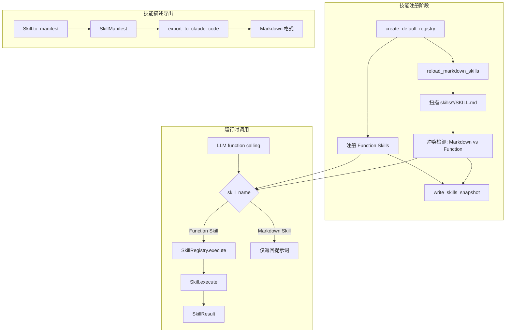
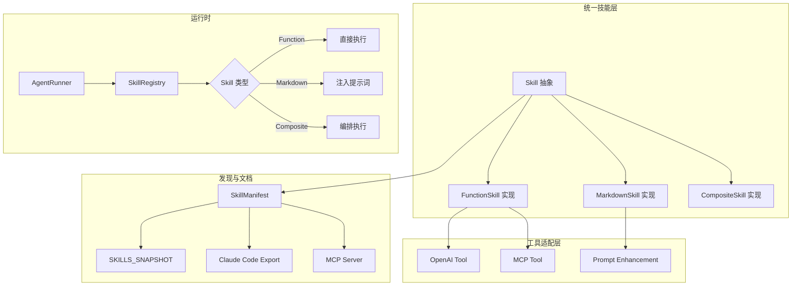

# Nini 项目技能系统架构分析报告

## 执行摘要

Nini 项目存在**两类技能系统**的架构设计：Function Skills（Python 类实现）和 Markdown Skills（声明式文档）。当前实现存在概念边界模糊、注册机制不统一、命名冲突处理不完备等问题。

**关键发现**：
1. Function Skills 通过 `SkillRegistry` 注册，支持完整的工具调用链路；Markdown Skills 通过文件扫描发现，主要用于提示词增强
2. `SkillManifest` 协议设计意图是统一技能描述，但实际仅用于导出，未充分发挥约束作用
3. 存在 29 个 Function Skills 和 1 个 Markdown Skill，`publication_figure` 是唯一活跃的 Markdown Skill
4. 技能与工具概念存在一定混淆：Function Skills 既是"技能"也是 LLM 的"工具"

**核心建议**：
- 短期：统一命名规范，修复冲突检测逻辑
- 中期：明确 Skill vs Tool 边界，完善 SkillManifest 协议
- 长期：考虑 MCP 桥接实现与 Claude Code Skills 的互通

---

## 1. 现状分析

### 1.1 概念对比

| 维度 | Function Skills (Python) | Markdown Skills (.md) |
|------|--------------------------|----------------------|
| **所在路径** | `src/nini/skills/*.py` | `skills/<name>/SKILL.md` |
| **设计意图** | 可编程的执行单元，直接操作 DataFrame 和 Session 状态 | 声明式的工作流程指导，用于增强 LLM 提示词 |
| **使用场景** | 数据统计分析、图表生成、代码执行等需要精确控制的场景 | 图表规范、分析流程指导等需要向 LLM 传递领域知识的场景 |
| **调用方式** | LLM 通过 function calling 调用 → SkillRegistry 分发 → 代码执行 | LLM 读取 Markdown 内容 → 指导后续操作 |
| **参数定义** | JSON Schema（`parameters` 属性），强类型约束 | 自然语言描述，无结构化约束 |
| **返回值格式** | 结构化 `SkillResult`（data、chart、artifacts 等） | 无返回值，仅作为提示词 |
| **注册机制** | 程序内显式注册（`registry.register()`） | 文件系统自动扫描（`scan_markdown_skills()`） |
| **版本管理** | 代码版本控制（Git） | 文件版本控制（Git） |
| **可测试性** | 高（可直接单元测试） | 低（依赖 LLM 解释效果） |
| **与 LLM 的交互方式** | OpenAI function calling 格式 | 系统提示词注入 |

### 1.2 架构组件

#### 1.2.1 SkillRegistry 类（`src/nini/skills/registry.py:47-319`）

**核心职责**：
- `_skills: dict[str, Skill]` - 存储 Function Skills
- `_markdown_skills: list[dict]` - 存储 Markdown Skills（仅元数据）

**关键方法分析**：

```python
# 注册 Function Skill，存在覆盖逻辑但仅打印警告
def register(self, skill: Skill) -> None:
    if skill.name in self._skills:
        logger.warning("技能 %s 已存在，将被覆盖", skill.name)
    self._skills[skill.name] = skill
```

**问题**：`register()` 仅对 Function Skills 之间的冲突做警告，不涉及 Markdown Skills。

```python
# reload_markdown_skills() 实现了冲突检测
def reload_markdown_skills(self) -> list[dict[str, Any]]:
    markdown_skills = scan_markdown_skills(settings.skills_dir)
    function_names = set(self._skills.keys())
    for skill in markdown_skills:
        item = skill.to_dict()
        if skill.name in function_names:
            item["enabled"] = False  # 禁用冲突的 Markdown Skill
            metadata["conflict_with"] = "function"
```

**设计观察**：
- Function Skills 优先于 Markdown Skills
- 冲突处理是单向的（仅检测 Markdown → Function 冲突）
- 不支持运行时动态注册 Function Skills

#### 1.2.2 SkillManifest 协议（`src/nini/skills/manifest.py:17-28`）

**设计目标**（从代码注释推断）：
> "Nini Skills 与 Claude Code Skills 的统一描述协议"

**实际使用情况**：
- `Skill.to_manifest()` - 导出为 Manifest
- `export_to_claude_code()` - 转换为 Markdown 格式
- `import_from_markdown()` - 从 Markdown 解析（但仅解析简单格式）

**约束作用评估**：
- ✅ 定义了统一的数据结构
- ❌ 未作为接口约束强制实现
- ❌ 未在运行时验证技能合规性
- ❌ Markdown Skill 无法转换为 SkillManifest

#### 1.2.3 scan_markdown_skills() 函数（`src/nini/skills/markdown_scanner.py:53-83`）

**扫描逻辑**：
```python
def scan_markdown_skills(skills_dir: Path) -> list[MarkdownSkill]:
    for path in sorted(skills_dir.rglob("SKILL.md")):
        text = path.read_text(encoding="utf-8")
        meta = _parse_frontmatter(text)  # 解析 YAML Frontmatter
        name = meta.get("name", "") or path.parent.name
        description = meta.get("description", "") or first_line
```

**问题识别**：
- 仅解析 Frontmatter，不解析正文内容
- 无版本信息支持
- 无依赖关系声明
- 错误处理仅打印警告，不中断流程

#### 1.2.4 SKILLS_SNAPSHOT.md（`data/SKILLS_SNAPSHOT.md`）

**生成逻辑**：
- 触发时机：`create_default_registry()` 最后一步调用 `write_skills_snapshot()`
- 内容：聚合 Function Skills + Markdown Skills 的元数据

**实际用途**：
- 给人看：开发者可快速浏览可用技能
- 给 LLM 看：可被纳入系统提示词

**准确性**：
- ✅ 名称、描述、位置信息准确
- ❌ 不反映运行时的动态变化（如技能被禁用）

### 1.3 当前架构图



### 1.4 与 Claude Code Skills 的对比

| 维度 | Nini Function Skills | Nini Markdown Skills | Claude Code Skills |
|------|----------------------|----------------------|-------------------|
| **载体** | Python 类 | Markdown 文件 | Markdown 文件 |
| **执行方式** | 代码执行 | 提示词增强 | 提示词指导 + 内置工具 |
| **参数** | JSON Schema | 自然语言 | 自然语言 |
| **状态访问** | 直接访问 Session | 无 | 通过 Read/Write/Bash 工具 |
| **互操作性** | 可导出为 Markdown | 无法导入为 Function | 格式相似但元数据不兼容 |

**互操作性障碍**：
1. Nini Markdown Skills 使用 Frontmatter 格式，Claude Code Skills 不使用
2. 参数描述格式不兼容（Claude Code 使用特定解析格式）
3. 执行模型完全不同

---

## 2. 问题清单

| 优先级 | 问题 | 影响范围 | 具体位置 | 建议方向 |
|--------|------|----------|----------|----------|
| **P0** | Skill vs Tool 概念混淆 | 架构设计理解 | `base.py:51` - `Skill` 类既是技能又是工具 | 明确概念边界：Tool 是技术接口，Skill 是业务概念 |
| **P0** | Markdown Skill 无法被调用 | 功能完整性 | `registry.py:142-144` - execute 仅查找 `_skills` | 统一调用入口，或明确 Markdown Skill 的只读性质 |
| **P1** | SkillManifest 协议未充分发挥约束作用 | 扩展性 | `manifest.py` - 仅为数据类，无接口约束 | 设计为抽象基类或协议类，强制实现 `to_manifest` |
| **P1** | Markdown Skills 缺乏结构化参数定义 | 一致性 | `markdown_scanner.py` - 仅解析 Frontmatter | 扩展 Frontmatter 格式，支持参数定义 |
| **P1** | 技能分类体系不统一 | 可维护性 | Function 使用 `category` 属性，Markdown 无分类 | 统一分类元数据 |
| **P1** | 新增技能流程文档缺失 | 开发者体验 | 无新增技能指南文档 | 创建 `docs/adding-skills.md` |
| **P2** | 冲突检测逻辑不完整 | 健壮性 | `registry.py:108-123` - 仅检测单向冲突 | 检测 Function 之间的冲突，提供配置选项 |
| **P2** | SKILLS_SNAPSHOT.md 格式不规范 | 可读性 | `data/SKILLS_SNAPSHOT.md` - 使用自定义格式 | 改为标准 YAML 或 JSON，便于程序解析 |
| **P2** | Markdown Skill 名称解析依赖文件夹名 | 可靠性 | `markdown_scanner.py:63` - `path.parent.name` | 强制要求 Frontmatter 中的 name 字段 |
| **P2** | 技能测试覆盖不完整 | 质量保障 | 仅部分技能有单元测试 | 为所有核心技能添加测试 |

---

## 3. 优化方案

### 3.1 概念定义

**技能（Skill）**：
> 一个面向用户的、具有明确业务目标的能力单元。例如："执行 t 检验"、"生成发表级图表"。

**工具（Tool）**：
> LLM 可调用的技术接口，具有严格的输入输出契约。例如：OpenAI function calling 定义的 `t_test` 工具。

**判定规则**：

| 问题 | Skill | Tool |
|------|-------|------|
| 是否有业务含义？ | 是 | 否（纯技术接口） |
| 用户是否直接提及？ | 是 | 否（LLM 内部使用） |
| 是否需要复杂编排？ | 可能 | 否（原子操作） |
| 是否有替代实现？ | 可以有多个 | 通常唯一 |

**当前映射关系**：
- Nini Function Skills = Skill + Tool（二合一）
- Nini Markdown Skills = Skill 描述（无 Tool 实现）

### 3.2 目标架构



**关键设计决策**：
1. **Skill 作为抽象基类**，统一 Function 和 Markdown 的接口
2. **Tool 作为输出格式**，Skill 可以被转换为多种 Tool 格式
3. **MCP 桥接**：未来通过 MCP Server 将 Nini Skills 暴露给 Claude Code

### 3.3 迁移路径

#### Phase 1 - 止血（1-2天）

**目标**：修复最紧急问题，不改变现有接口

**任务**：
- [ ] 修复 `execute()` 方法对 Markdown Skill 的错误处理（给出明确错误提示）
- [ ] 完善 `register()` 的冲突检测，覆盖 Function Skill 之间的冲突
- [ ] 添加 `publication_figure` 技能的完整性检查（当前是唯一 Markdown Skill）

**验证标准**：
- 现有测试全部通过
- 尝试调用 Markdown Skill 得到明确错误提示而非 500

#### Phase 2 - 统一（3-5天）

**目标**：统一注册机制和元数据格式

**任务**：
- [ ] 扩展 `MarkdownSkill` 类，实现与 `FunctionSkill` 相同的基类接口
- [ ] 统一 `category` 分类体系（数据操作/统计分析/可视化/报告/工作流）
- [ ] 设计新的 Frontmatter 格式，支持参数定义和分类
- [ ] 创建 `docs/adding-skills.md` 开发者指南

**验证标准**：
- 所有技能可通过 `list_skill_catalog()` 统一发现
- Markdown Skills 支持 `to_manifest()` 导出
- 新增技能文档完整

#### Phase 3 - 优化（5-10天）

**目标**：实现目标架构，完善开发者工具

**任务**：
- [ ] 实现 `Skill` 抽象基类，重构现有技能继承关系
- [ ] 设计 `ToolAdapter` 层，支持多种工具格式导出
- [ ] 实现 MCP Server 原型，暴露 Nini Skills 给外部
- [ ] 创建技能脚手架 CLI：`nini skills create <name> --type=function|markdown`

**验证标准**：
- 新增技能流程步骤减少 50%+
- `export_to_claude_code()` 输出与 Claude Code Skills 格式兼容
- MCP Server 可通过 Claude Code 调用 Nini Skills

### 3.4 风险评估

| 阶段 | 风险点 | 影响 | 缓解措施 |
|------|--------|------|----------|
| Phase 1 | 冲突检测改动可能影响启动性能 | 低 | 扫描逻辑仅在 `create_default_registry()` 执行一次 |
| Phase 2 | Frontmatter 格式变更需同步更新现有 Markdown Skill | 中 | 提供迁移脚本自动更新 |
| Phase 3 | 抽象基类重构可能破坏现有技能 | 高 | 保持 `Skill` 类接口向后兼容，渐进迁移 |
| Phase 3 | MCP Server 引入新依赖 | 中 | 作为可选组件，不影响核心功能 |

**回滚策略**：
- Phase 1/2：所有改动向后兼容，可直接回滚代码
- Phase 3：新架构作为并行实现，老代码保留 deprecated 标记

---

## 4. 实施建议

### 4.1 Quick Wins（立即可做）

1. **完善错误提示**（30分钟）
   ```python
   # registry.py:143
   if skill is None:
       # 检查是否是 Markdown Skill
       if skill_name in [m["name"] for m in self._markdown_skills]:
           return {"success": False, "message": f"'{skill_name}' 是提示词技能，无法直接调用"}
       return {"success": False, "message": f"未知技能: {skill_name}"}
   ```

2. **统一分类**（1小时）
   - 审查所有技能的 `category` 属性
   - 标准化为：data（数据操作）、statistics（统计分析）、visualization（可视化）、export（导出）、report（报告）、workflow（工作流）、utility（工具）

3. **补充文档**（2小时）
   - 创建 `docs/adding-skills.md`
   - 包含：Function Skill 创建步骤、Markdown Skill 创建步骤、测试要求

### 4.2 短期改进（本周）

1. **创建技能提案**（按 OpenSpec 流程）
   - Change ID: `unify-skill-system`
   - 包含 Phase 1 和 Phase 2 的任务
   - 创建 design.md 描述目标架构

2. **完善 Markdown Skill 格式**
   - 扩展 Frontmatter 支持 `category`、`examples`、`output_types`
   - 更新 `publication_figure/SKILL.md` 作为示例

3. **增强冲突检测**
   - 在 `register()` 中添加 Function Skill 之间冲突的检测
   - 支持通过配置选择冲突处理策略（覆盖/报错/忽略）

### 4.3 中期目标（本月）

1. **实现 Skill 抽象基类**
   - 设计 `BaseSkill` 抽象类
   - 定义 `execute()`、`to_manifest()`、`get_tool_definition()` 接口
   - 重构现有技能逐步迁移

2. **MCP 桥接探索**
   - 调研 MCP SDK
   - 实现原型验证可行性
   - 评估与 Claude Code 的互通效果

3. **开发者工具**
   - 技能脚手架 CLI
   - 技能验证工具（检查命名、分类、文档完整性）

---

## 附录

### A. 当前技能完整清单

**Function Skills（29个）**：

| 分类 | 技能名称 | 描述 |
|------|----------|------|
| 数据操作 | `load_dataset` | 加载已上传的数据集 |
| 数据操作 | `preview_data` | 预览数据集的前后部分行数据 |
| 数据操作 | `data_summary` | 计算数据集的全面统计摘要 |
| 统计分析 | `t_test` | 执行 t 检验（独立/配对/单样本） |
| 统计分析 | `mann_whitney` | 执行 Mann-Whitney U 检验 |
| 统计分析 | `anova` | 执行单因素方差分析 |
| 统计分析 | `kruskal_wallis` | 执行 Kruskal-Wallis H 检验 |
| 统计分析 | `correlation` | 计算相关性矩阵 |
| 统计分析 | `regression` | 执行线性回归分析 |
| 统计分析 | `multiple_comparison_correction` | 多重比较校正 |
| 可视化 | `create_chart` | 快速创建简单标准图表 |
| 导出 | `export_chart` | 导出图表为文件 |
| 数据操作 | `clean_data` | 执行数据清洗 |
| 数据操作 | `recommend_cleaning_strategy` | 智能推荐清洗策略 |
| 数据操作 | `evaluate_data_quality` | 评估数据集质量 |
| 数据操作 | `generate_quality_report` | 生成数据质量报告 |
| 报告 | `generate_report` | 生成结构化 Markdown 分析报告 |
| 工作流 | `save_workflow` | 保存分析步骤为工作流模板 |
| 工作流 | `list_workflows` | 列出已保存的工作流模板 |
| 工作流 | `apply_workflow` | 执行已保存的工作流模板 |
| 工具 | `organize_workspace` | 整理工作区文件 |
| 工具 | `fetch_url` | 抓取 URL 内容 |
| 代码执行 | `run_code` | 在受限沙箱中运行 Python 代码 |
| 工作流 | `complete_comparison` | 完整两组比较分析 |
| 工作流 | `complete_anova` | 完整多组均值比较分析 |
| 工作流 | `correlation_analysis` | 完整变量关联分析 |
| 工具 | `interpret_statistical_result` | 智能解读统计检验结果 |

**Markdown Skills（1个）**：

| 分类 | 技能名称 | 描述 |
|------|----------|------|
| 可视化 | `publication_figure` | 生成符合顶级期刊标准的科研图表 |

### B. 关键代码引用

**Skill 基类定义**：`src/nini/skills/base.py:51-114`

**SkillRegistry 注册逻辑**：`src/nini/skills/registry.py:56-66`

**Markdown 扫描逻辑**：`src/nini/skills/markdown_scanner.py:53-83`

**SkillManifest 定义**：`src/nini/skills/manifest.py:17-28`

### C. 相关文档链接

- [技能兼容性分析](../skills-compatibility.md)
- [OpenSpec Agent 指南](../../openspec/AGENTS.md)
- [Claude Code Skills 文档](https://docs.anthropic.com/en/docs/skills)
- [MCP 协议规范](https://modelcontextprotocol.io/)

---

*报告生成时间：2026-02-14*
*分析范围：src/nini/skills/、skills/、docs/skills-compatibility.md*
