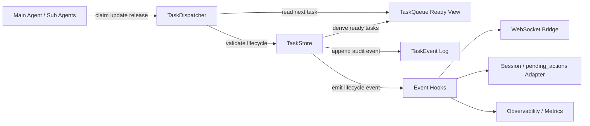

# nini TODO Architecture

## 设计目标

1. 把任务状态从 `runner` 特判和消息回放里抽出来，形成独立模块。
References: `[C3]`, `[N5]`, `[N7]`

2. 保留 `nini` 当前任务模型里对 `depends_on/action_id/tool_hint` 的表达能力，但让依赖真正参与调度。
References: `[N2]`, `[N9]`

3. 补上多代理认领、释放、失败与取消这些一等生命周期，避免 `dispatch_agents` 与任务板脱节。
References: `[C4]`, `[C5]`, `[N3]`, `[N8]`

4. 把 `pending_actions` 视为任务事件流的旁路消费者，而不是第二套核心状态系统。
References: `[C6]`, `[N10]`

## 核心结论

- `TaskStore` 应成为唯一任务真相源，避免 `[N5][N6]` 这种“消息回放重建状态”的脆弱路径。
- `TaskQueue` 不单独持久化，而是由 `TaskStore` 派生“当前可认领任务视图”，避免重复状态。
References: `[C1]`, `[C3]`, `[N1]`
- `TaskDispatcher` 负责“claim / release / start / finish / fail / cancel”的状态推进与校验，不再把自动完成逻辑塞进工具层。
References: `[N4]`, `[N7]`
- `Event hooks` 负责把任务变化桥接到 WebSocket、审计日志、`pending_actions` 或 session 兼容层，借鉴 `claw-code` 的“执行状态与展示分离”思路。
References: `[C5]`, `[N10]`

## 3a. Architecture Diagram



### 组件职责

- `TaskStore`
  - 保存任务快照与事件日志。
  - 提供 CRUD、过滤查询、依赖检查、状态迁移入口。
  - 可选 JSON 持久化，作为 Phase 4 骨架的最小落地形态。
  - References: `[C1]`, `[C6]`, `[N1]`, `[N5]`

- `TaskQueue`
  - 不是独立数据库对象，而是 `TaskStore` 派生的“ready tasks”视图。
  - 只暴露“依赖已满足且可认领”的任务列表。
  - References: `[C4]`, `[N2]`, `[N9]`

- `TaskDispatcher`
  - 负责任务认领、释放、启动、完成、失败、取消。
  - 统一校验 `pending -> assigned -> in_progress -> done|failed|cancelled`，并允许操作性释放回到 `pending`。
  - References: `[C3]`, `[N3]`, `[N4]`, `[N8]`

- `Agent workers`
  - 主 Agent 和子 Agent 都只通过 dispatcher 与任务交互。
  - 子 Agent 不再维护自己的独立任务板，而是持有被认领任务的上下文快照。
  - References: `[C5]`, `[N8]`

- `Event hooks`
  - 把任务事件桥接到现有 WebSocket 事件、session meta、`pending_actions` 兼容层。
  - 避免继续在 `runner.py` 中堆积 TODO 特判逻辑。
  - References: `[C5]`, `[N7]`, `[N10]`

## 3b. Data Model Definition

设计说明：

- `TaskStatus` 采用用户要求的生命周期：`pending -> assigned -> in_progress -> done | failed | cancelled`。
- `Task` 预留 `priority/dependency_ids/deadline_at`，但 Phase 4 只实现基础字段和依赖检查。
- `TaskEvent` 作为审计日志与桥接层输入，替代 `[N5]` 的消息回放恢复。

```python
from __future__ import annotations

from dataclasses import dataclass, field
from datetime import datetime
from enum import StrEnum
from typing import Any


class TaskStatus(StrEnum):
    PENDING = "pending"
    ASSIGNED = "assigned"
    IN_PROGRESS = "in_progress"
    DONE = "done"
    FAILED = "failed"
    CANCELLED = "cancelled"


@dataclass(slots=True)
class Task:
    task_id: str
    title: str
    description: str = ""
    status: TaskStatus = TaskStatus.PENDING
    assigned_agent_id: str | None = None
    created_at: datetime = field(default_factory=datetime.utcnow)
    updated_at: datetime = field(default_factory=datetime.utcnow)
    assigned_at: datetime | None = None
    started_at: datetime | None = None
    finished_at: datetime | None = None
    priority: int | None = None
    dependency_ids: list[str] = field(default_factory=list)
    deadline_at: datetime | None = None
    metadata: dict[str, Any] = field(default_factory=dict)


@dataclass(slots=True)
class TaskEvent:
    event_id: str
    task_id: str
    event_type: str
    actor_id: str | None
    occurred_at: datetime
    from_status: TaskStatus | None = None
    to_status: TaskStatus | None = None
    message: str | None = None
    payload: dict[str, Any] = field(default_factory=dict)
```

### 状态迁移规则

```text
pending     -> assigned | cancelled
assigned    -> pending   | in_progress | cancelled
in_progress -> pending   | done        | failed | cancelled
done        -> (terminal)
failed      -> (terminal)
cancelled   -> (terminal)
```

说明：

- `assigned -> pending` 与 `in_progress -> pending` 仅表示“释放任务”，不是正常业务完成路径。
- `done/failed/cancelled` 保持终态，后续如需 retry，应通过显式“clone / reopen”能力实现。
References: `[C3]`, `[N4]`

## 3c. Module Structure

考虑 `nini` 当前包结构，实际落地路径使用 `src/nini/todo/`，而不是仓库根级 `src/todo/`。

```text
src/
  nini/
    todo/
      models.py       # Task / TaskStatus / TaskEvent dataclass 与序列化
      store.py        # 任务快照、事件日志、JSON 持久化、状态迁移校验
      dispatcher.py   # claim / release / start / done / fail / cancel / ready queue
      hooks.py        # 生命周期事件回调注册与广播
      index.py        # 对外统一 API
      __init__.py     # 兼容 Python 包导出
```

### 模块边界

- `models.py`
  - 只放纯数据结构与序列化逻辑。
  - 不依赖 `Session`、WebSocket 或具体工具。
  - References: `[C1]`, `[N2]`

- `store.py`
  - 负责唯一真相源、CRUD、事件追加、依赖校验、状态迁移校验。
  - 不知道“哪个 Agent 应该接什么任务”，只知道某次状态变更是否合法。
  - References: `[C3]`, `[N5]`, `[N6]`

- `dispatcher.py`
  - 基于 store 暴露给主 Agent / 子 Agent 的认领 API。
  - `claim_next_task()` 会优先取依赖已满足的 `pending` 任务。
  - References: `[C4]`, `[C5]`, `[N8]`, `[N9]`

- `hooks.py`
  - 提供可插拔事件订阅机制。
  - Phase 4 只实现通用 hook registry，具体接入 `runner.py`、`session.py`、WebSocket 留待后续 wiring。
  - References: `[C5]`, `[N7]`, `[N10]`

- `index.py`
  - 统一导出异常类型、数据模型、store、dispatcher，避免未来再次把逻辑散回 `runner.py`。
  - References: `[N7]`

## 与现有系统的衔接策略

1. `task_state/task_write` 后续改为兼容层，只把 LLM 输入翻译成 `TaskStore/TaskDispatcher` 调用。
References: `[N3]`, `[N7]`

2. `dispatch_agents` 派发前先向 dispatcher claim 任务，子 Agent 完成后通过 dispatcher 回写 `done/failed/released`。
References: `[N8]`

3. `pending_actions` 不再承载核心任务状态，只消费 `TaskEvent` 做阻塞提示和恢复建议。
References: `[N10]`

4. 前端继续接收 `ANALYSIS_PLAN/PLAN_STEP_UPDATE/TASK_ATTEMPT`，但数据源改为 TODO 模块，而不是 `runner.py` 特判分支。
References: `[N7]`, `[N9]`
