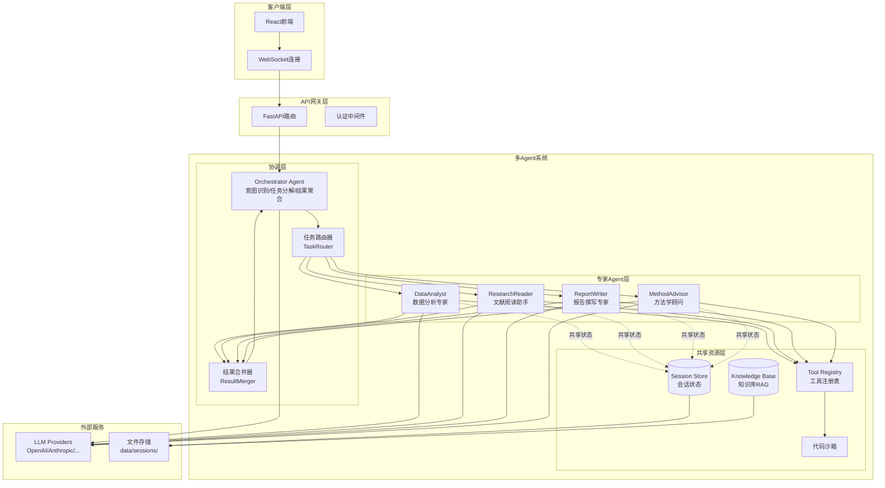
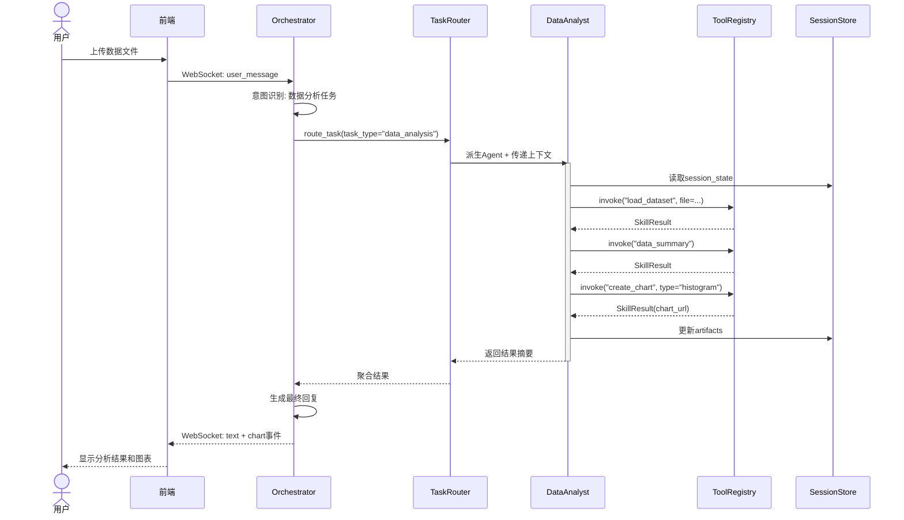
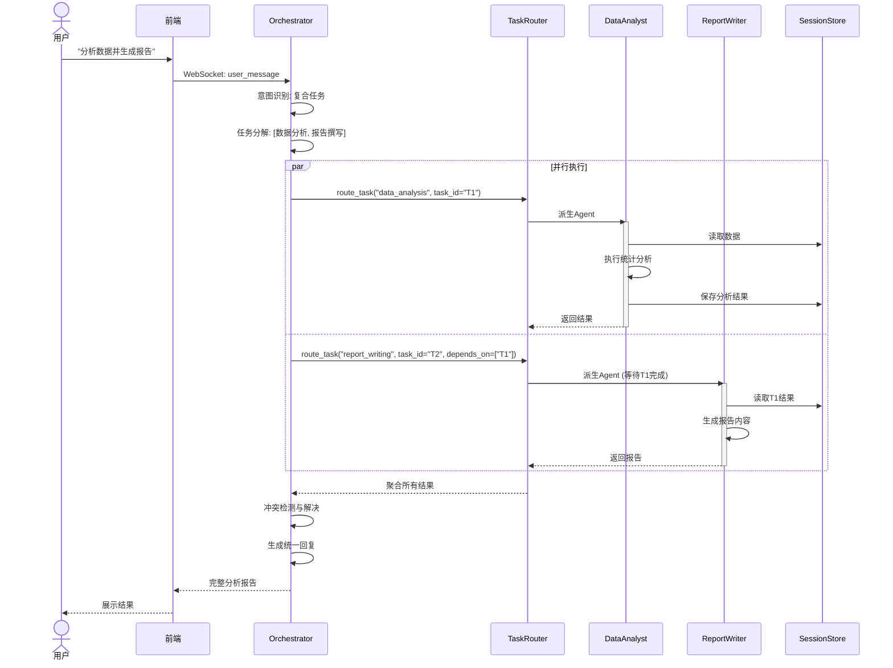

# Scientific Nini 多Agent协作架构设计

> 提案编号：P004
> 版本：v1.0
> 日期：2026-03-15
> 状态：Design

---

## 1. 设计目标

将 Scientific Nini 从单Agent架构演进为**层次化多Agent协作系统**，以更好地服务科研全流程场景：

- **专业化**：每个Agent专注特定科研场景，深度优化
- **可扩展**：新科研场景可通过新增Agent快速接入
- **高效率**：并行执行独立任务，缩短整体响应时间
- **可观测**：完整的执行链路追踪，便于调试和优化

---

## 2. Agent角色定义表

### 2.1 核心Agent

| Agent名称 | 角色定位 | 职责范围 | 模型建议 | 优先级 |
|-----------|----------|----------|----------|--------|
| **Orchestrator** | 中央协调者 | 意图识别、任务分解、Agent调度、结果聚合 | Sonnet | P0 |
| **DataAnalyst** | 数据分析专家 | 数据清洗、统计分析、可视化生成 | Sonnet | P0 |
| **ResearchReader** | 文献阅读助手 | PDF解析、多模态理解、信息提取、跨文献对比 | Sonnet | P1 |
| **ReportWriter** | 报告撰写专家 | 结果解读、学术写作、格式排版 | Haiku | P1 |
| **MethodAdvisor** | 方法学顾问 | 实验设计、统计方法推荐、样本量计算 | Sonnet | P2 |

### 2.2 Agent能力矩阵

```
┌─────────────────┬──────────┬────────────┬─────────────┬──────────────┬─────────────┐
│     场景        │Orchestrator│DataAnalyst│ResearchReader│ReportWriter │MethodAdvisor│
├─────────────────┼──────────┼────────────┼─────────────┼──────────────┼─────────────┤
│ 数据清洗与分析  │    调度   │    执行     │      -      │      -       │      -      │
│ 统计建模        │    调度   │    执行     │      -      │    协助      │    协助     │
│ 文献精读        │    调度   │      -      │    执行     │      -       │      -      │
│ 论文撰写        │    调度   │      -      │      -      │    执行      │      -      │
│ 实验设计        │    调度   │      -      │      -      │      -       │    执行     │
│ 复杂多步任务    │    编排   │    子任务   │    子任务   │    子任务    │    子任务   │
└─────────────────┴──────────┴────────────┴─────────────┴──────────────┴─────────────┘
```

---

## 3. 系统架构图



---

## 4. 主/子Agent交互时序图

### 4.1 单Agent任务执行流程



### 4.2 多Agent并行任务执行流程



### 4.3 动态Agent派生流程

```mermaid
sequenceDiagram
    participant ORC as Orchestrator
    participant AF as AgentFactory
    participant DA as DataAnalyst
    participant Sandbox as 代码沙箱
    participant LLM as LLM服务

    ORC->>ORC: 识别需要专业Agent
    ORC->>AF: create_agent(
        agent_type="DataAnalyst",
        session_id="sess_123",
        parent_context={...}
    )

    AF->>AF: 加载Agent配置
    AF->>AF: 初始化独立上下文
    AF->>Sandbox: 创建隔离执行环境
    AF-->>ORC: 返回Agent实例

    ORC->>DA: execute(task, callback=on_progress)

    loop ReAct循环
        DA->>DA: 思考(Thought)
        DA->>LLM: chat(messages)
        LLM-->>DA: tool_calls
        DA->>DA: 行动(Action)
        DA->>ORC: callback(progress_event)
    end

    DA-->>ORC: 返回最终结果
    ORC->>AF: destroy_agent(DA)
    AF->>Sandbox: 清理执行环境
```

---

## 5. 关键接口伪代码

### 5.1 Agent注册表

```python
# src/nini/agent/registry.py

from enum import Enum
from typing import Type, Callable
from dataclasses import dataclass

class AgentType(Enum):
    ORCHESTRATOR = "orchestrator"
    DATA_ANALYST = "data_analyst"
    RESEARCH_READER = "research_reader"
    REPORT_WRITER = "report_writer"
    METHOD_ADVISOR = "method_advisor"

@dataclass
class AgentConfig:
    """Agent配置"""
    agent_type: AgentType
    display_name: str
    description: str
    system_prompt: str
    model: str  # 默认模型
    tools: list[str]  # 可用工具列表
    max_iterations: int = 10
    temperature: float = 0.7

class AgentRegistry:
    """Agent注册表 - 管理所有Agent类型定义"""

    _agents: dict[AgentType, AgentConfig] = {}
    _factories: dict[AgentType, Callable] = {}

    @classmethod
    def register(
        cls,
        agent_type: AgentType,
        config: AgentConfig,
        factory: Callable
    ) -> None:
        """注册Agent类型"""
        cls._agents[agent_type] = config
        cls._factories[agent_type] = factory

    @classmethod
    def get_config(cls, agent_type: AgentType) -> AgentConfig:
        """获取Agent配置"""
        return cls._agents[agent_type]

    @classmethod
    def create_agent(
        cls,
        agent_type: AgentType,
        session_id: str,
        parent_context: dict | None = None
    ) -> "BaseAgent":
        """创建Agent实例"""
        factory = cls._factories[agent_type]
        config = cls._agents[agent_type]
        return factory(config, session_id, parent_context)

    @classmethod
    def list_agents(cls) -> list[AgentConfig]:
        """列出所有可用Agent"""
        return list(cls._agents.values())


# 初始化注册
AgentRegistry.register(
    AgentType.DATA_ANALYST,
    config=AgentConfig(
        agent_type=AgentType.DATA_ANALYST,
        display_name="数据分析专家",
        description="专注于数据清洗、统计分析和可视化",
        system_prompt="你是一位数据分析专家...",
        model="claude-sonnet-4-6",
        tools=[
            "load_dataset", "preview_data", "data_summary",
            "clean_data", "t_test", "anova", "correlation",
            "regression", "create_chart", "run_code"
        ]
    ),
    factory=DataAnalystAgent
)
```

### 5.2 动态Agent派生

```python
# src/nini/agent/factory.py

import uuid
from contextlib import asynccontextmanager

class AgentFactory:
    """Agent工厂 - 负责创建和管理Agent生命周期"""

    def __init__(self):
        self._active_agents: dict[str, BaseAgent] = {}
        self._sandbox_pool = SandboxPool()

    async def create_agent(
        self,
        agent_type: AgentType,
        session_id: str,
        parent_context: dict | None = None,
        task_id: str | None = None
    ) -> BaseAgent:
        """
        动态创建Agent实例

        Args:
            agent_type: Agent类型
            session_id: 所属会话ID
            parent_context: 父Agent传递的上下文
            task_id: 关联任务ID
        """
        agent_id = f"{agent_type.value}_{uuid.uuid4().hex[:8]}"

        # 加载配置
        config = AgentRegistry.get_config(agent_type)

        # 创建隔离上下文
        context = AgentContext(
            agent_id=agent_id,
            session_id=session_id,
            task_id=task_id,
            parent_context=parent_context,
            created_at=datetime.now(timezone.utc)
        )

        # 分配沙箱环境
        sandbox = await self._sandbox_pool.acquire(session_id)

        # 创建Agent实例
        agent = AgentRegistry.create_agent(
            agent_type=agent_type,
            session_id=session_id,
            parent_context=parent_context
        )
        agent.initialize(context, sandbox)

        self._active_agents[agent_id] = agent

        logger.info(f"Agent创建: {agent_id}, 类型: {agent_type.value}")
        return agent

    async def destroy_agent(self, agent_id: str) -> None:
        """销毁Agent实例，释放资源"""
        if agent_id not in self._active_agents:
            return

        agent = self._active_agents[agent_id]

        # 保存最终状态
        await agent.checkpoint()

        # 释放沙箱
        if agent.sandbox:
            await self._sandbox_pool.release(agent.sandbox)

        # 清理引用
        del self._active_agents[agent_id]

        logger.info(f"Agent销毁: {agent_id}")

    @asynccontextmanager
    async def agent_scope(
        self,
        agent_type: AgentType,
        session_id: str,
        parent_context: dict | None = None
    ):
        """Agent上下文管理器 - 确保资源释放"""
        agent = await self.create_agent(agent_type, session_id, parent_context)
        try:
            yield agent
        finally:
            await self.destroy_agent(agent.agent_id)


# 使用示例
async def analyze_data(session_id: str, file_path: str):
    factory = AgentFactory()

    async with factory.agent_scope(
        AgentType.DATA_ANALYST,
        session_id=session_id,
        parent_context={"file_path": file_path}
    ) as agent:
        result = await agent.execute(task="分析数据文件")
        return result
```

### 5.3 任务路由器

```python
# src/nini/agent/router.py

from typing import AsyncIterator
import asyncio

class TaskRouter:
    """任务路由器 - 将任务分配给合适的Agent执行"""

    def __init__(self, factory: AgentFactory):
        self.factory = factory
        self._task_queue: asyncio.PriorityQueue = asyncio.PriorityQueue()
        self._executing_tasks: dict[str, asyncio.Task] = {}

    async def route_task(
        self,
        task: Task,
        session_id: str,
        parent_context: dict | None = None
    ) -> TaskResult:
        """
        路由单个任务到对应Agent

        Args:
            task: 任务定义
            session_id: 会话ID
            parent_context: 父上下文

        Returns:
            TaskResult: 任务执行结果
        """
        # 确定Agent类型
        agent_type = self._resolve_agent_type(task)

        # 创建Agent并执行
        async with self.factory.agent_scope(
            agent_type, session_id, parent_context
        ) as agent:
            result = await agent.execute(task)
            return result

    async def route_parallel(
        self,
        tasks: list[Task],
        session_id: str,
        parent_context: dict | None = None,
        max_concurrency: int = 4
    ) -> list[TaskResult]:
        """
        并行路由多个任务

        Args:
            tasks: 任务列表
            session_id: 会话ID
            parent_context: 父上下文
            max_concurrency: 最大并发数

        Returns:
            list[TaskResult]: 结果列表（保持顺序）
        """
        semaphore = asyncio.Semaphore(max_concurrency)

        async def execute_with_limit(task: Task) -> TaskResult:
            async with semaphore:
                return await self.route_task(task, session_id, parent_context)

        # 并发执行所有任务
        results = await asyncio.gather(
            *[execute_with_limit(t) for t in tasks],
            return_exceptions=True
        )

        # 处理异常
        processed_results = []
        for i, result in enumerate(results):
            if isinstance(result, Exception):
                processed_results.append(TaskResult(
                    task_id=tasks[i].task_id,
                    status="failed",
                    error=str(result)
                ))
            else:
                processed_results.append(result)

        return processed_results

    def _resolve_agent_type(self, task: Task) -> AgentType:
        """根据任务类型解析Agent类型"""
        mapping = {
            TaskType.DATA_CLEANING: AgentType.DATA_ANALYST,
            TaskType.STATISTICAL_ANALYSIS: AgentType.DATA_ANALYST,
            TaskType.VISUALIZATION: AgentType.DATA_ANALYST,
            TaskType.LITERATURE_READING: AgentType.RESEARCH_READER,
            TaskType.PAPER_WRITING: AgentType.REPORT_WRITER,
            TaskType.EXPERIMENT_DESIGN: AgentType.METHOD_ADVISOR,
        }
        return mapping.get(task.task_type, AgentType.ORCHESTRATOR)

    async def stream_task(
        self,
        task: Task,
        session_id: str,
        callback: Callable[[AgentEvent], None]
    ) -> TaskResult:
        """流式执行任务，实时推送进度事件"""
        agent_type = self._resolve_agent_type(task)

        async with self.factory.agent_scope(agent_type, session_id) as agent:
            # 设置回调
            agent.set_progress_callback(callback)

            # 执行并流式返回
            async for event in agent.execute_stream(task):
                callback(event)

            return agent.final_result
```

### 5.4 结果聚合器

```python
# src/nini/agent/merger.py

from typing import Protocol

class ConflictResolver(Protocol):
    """冲突解决策略接口"""

    async def resolve(
        self,
        conflicts: list[Conflict]
    ) -> Resolution:
        """解决结果冲突"""
        ...

class ResultMerger:
    """结果合并器 - 聚合多个Agent的执行结果"""

    def __init__(self, resolver: ConflictResolver | None = None):
        self.resolver = resolver or DefaultConflictResolver()

    async def merge(
        self,
        results: list[TaskResult],
        merge_strategy: MergeStrategy = MergeStrategy.UNION
    ) -> MergedResult:
        """
        合并多个任务结果

        Args:
            results: 任务结果列表
            merge_strategy: 合并策略

        Returns:
            MergedResult: 合并后的结果
        """
        # 1. 收集所有产物
        all_artifacts = []
        for r in results:
            all_artifacts.extend(r.artifacts)

        # 2. 检测冲突
        conflicts = self._detect_conflicts(results)

        # 3. 解决冲突
        if conflicts:
            resolution = await self.resolver.resolve(conflicts)
        else:
            resolution = None

        # 4. 根据策略合并内容
        if merge_strategy == MergeStrategy.UNION:
            content = self._union_merge(results)
        elif merge_strategy == MergeStrategy.INTERSECTION:
            content = self._intersection_merge(results)
        elif merge_strategy == MergeStrategy.WEIGHTED:
            content = self._weighted_merge(results)
        else:
            content = self._concat_merge(results)

        # 5. 去重产物
        unique_artifacts = self._deduplicate_artifacts(all_artifacts)

        return MergedResult(
            content=content,
            artifacts=unique_artifacts,
            sources=[r.agent_id for r in results],
            conflicts_resolved=resolution
        )

    def _detect_conflicts(self, results: list[TaskResult]) -> list[Conflict]:
        """检测结果间的冲突"""
        conflicts = []

        # 检查数值冲突（如不同Agent计算的统计量）
        numerical_values = defaultdict(list)
        for r in results:
            for key, value in r.data.items():
                if isinstance(value, (int, float)):
                    numerical_values[key].append((r.agent_id, value))

        for key, values in numerical_values.items():
            if len(values) > 1:
                vals = [v for _, v in values]
                if max(vals) - min(vals) > 0.01 * min(vals):  # 5%差异阈值
                    conflicts.append(Conflict(
                        type=ConflictType.NUMERICAL,
                        field=key,
                        values=values
                    ))

        # 检查逻辑冲突（如矛盾结论）
        conclusions = [r.conclusion for r in results if r.conclusion]
        if len(conclusions) > 1:
            # 使用LLM判断结论是否矛盾
            conflict = self._check_logical_conflict(conclusions)
            if conflict:
                conflicts.append(conflict)

        return conflicts

    def _deduplicate_artifacts(
        self,
        artifacts: list[Artifact]
    ) -> list[Artifact]:
        """基于内容哈希去重产物"""
        seen = set()
        unique = []

        for artifact in artifacts:
            content_hash = hashlib.md5(
                artifact.content.encode()
            ).hexdigest()

            if content_hash not in seen:
                seen.add(content_hash)
                unique.append(artifact)

        return unique


class DebateResolver(ConflictResolver):
    """辩论式冲突解决 - 让Agent讨论达成共识"""

    async def resolve(self, conflicts: list[Conflict]) -> Resolution:
        """通过多轮辩论解决冲突"""
        # 创建辩论上下文
        debate_context = DebateContext(conflicts)

        # 邀请相关Agent参与辩论
        participants = self._invite_participants(conflicts)

        # 多轮辩论
        for round_num in range(3):  # 最多3轮
            for participant in participants:
                argument = await participant.debate(debate_context)
                debate_context.add_argument(argument)

            # 检查是否达成共识
            if debate_context.has_consensus():
                break

        # 生成最终决议
        return debate_context.generate_resolution()
```

### 5.5 Orchestrator核心逻辑

```python
# src/nini/agent/orchestrator.py

class OrchestratorAgent(BaseAgent):
    """
    中央协调Agent - 负责意图识别、任务分解和结果聚合
    """

    def __init__(self):
        self.router = TaskRouter(AgentFactory())
        self.merger = ResultMerger(DebateResolver())
        self.planner = PlanParser()

    async def process(
        self,
        user_message: str,
        session_id: str,
        stream_callback: Callable[[AgentEvent], None] | None = None
    ) -> OrchestratorResult:
        """
        处理用户消息的主入口

        Args:
            user_message: 用户输入
            session_id: 会话ID
            stream_callback: 流式回调

        Returns:
            OrchestratorResult: 处理结果
        """
        # 1. 意图识别
        intent = await self._recognize_intent(user_message, session_id)

        # 2. 判断是否需要多Agent协作
        if intent.complexity == Complexity.SIMPLE:
            # 简单任务：直接路由到对应Agent
            return await self._handle_simple_task(intent, session_id, stream_callback)

        # 3. 复杂任务：分解并并行执行
        return await self._handle_complex_task(intent, session_id, stream_callback)

    async def _handle_complex_task(
        self,
        intent: Intent,
        session_id: str,
        callback: Callable[[AgentEvent], None] | None
    ) -> OrchestratorResult:
        """处理复杂多步骤任务"""

        # 3.1 任务分解
        plan = await self._decompose_task(intent)

        # 3.2 构建依赖图
        dag = self._build_dependency_graph(plan.tasks)

        # 3.3 按拓扑顺序执行
        results = {}
        for batch in dag.topological_batches():
            # 并行执行当前批次
            batch_results = await self.router.route_parallel(
                tasks=batch,
                session_id=session_id,
                parent_context={"plan": plan, "previous_results": results},
                max_concurrency=4
            )

            # 收集结果
            for task, result in zip(batch, batch_results):
                results[task.task_id] = result

                # 流式推送进度
                if callback:
                    callback(AgentEvent(
                        type=EventType.TASK_COMPLETED,
                        task_id=task.task_id,
                        data=result.summary
                    ))

        # 3.4 聚合所有结果
        final_result = await self.merger.merge(
            list(results.values()),
            merge_strategy=MergeStrategy.WEIGHTED
        )

        # 3.5 生成统一回复
        response = await self._generate_response(
            intent=intent,
            results=results,
            merged_result=final_result
        )

        return OrchestratorResult(
            response=response,
            artifacts=final_result.artifacts,
            execution_log=self._build_execution_log(results)
        )

    async def _decompose_task(self, intent: Intent) -> ExecutionPlan:
        """将复杂任务分解为子任务"""
        # 使用LLM进行任务分解
        decomposition_prompt = f"""
        请将以下科研任务分解为可并行执行的子任务：

        用户请求：{intent.description}
        已识别意图：{intent.primary_goal}

        要求：
        1. 每个子任务应该是原子性的，可独立完成
        2. 明确子任务间的依赖关系
        3. 为每个子任务分配合适的Agent类型
        4. 估计每个子任务的复杂度

        输出格式：
        ```json
        {{
            "tasks": [
                {{
                    "task_id": "T1",
                    "description": "任务描述",
                    "agent_type": "data_analyst",
                    "dependencies": [],
                    "estimated_complexity": "medium"
                }}
            ]
        }}
        ```
        """

        response = await self.llm.chat(decomposition_prompt)
        plan_data = json.loads(response)

        return ExecutionPlan(
            plan_id=f"plan_{uuid.uuid4().hex[:8]}",
            tasks=[Task(**t) for t in plan_data["tasks"]]
        )

    def _build_dependency_graph(self, tasks: list[Task]) -> DAG:
        """构建任务依赖图"""
        dag = DAG()

        for task in tasks:
            dag.add_node(task.task_id, task)

        for task in tasks:
            for dep_id in task.dependencies:
                dag.add_edge(dep_id, task.task_id)

        return dag
```

---

## 6. 分阶段实施计划

### Phase 1: 基础架构（2-3周）

**目标**：建立多Agent基础框架，实现Agent注册、派生、路由核心能力

**任务清单：**

| 任务 | 描述 | 关键文件 |
|------|------|----------|
| T1 | Agent基类重构 | `agent/base.py` |
| T2 | Agent注册表实现 | `agent/registry.py` |
| T3 | Agent工厂实现 | `agent/factory.py` |
| T4 | 任务路由器实现 | `agent/router.py` |
| T5 | Orchestrator改造 | `agent/orchestrator.py` |
| T6 | 事件系统扩展 | `agent/events.py` |

**验收标准：**
- [ ] 可动态创建/销毁Agent实例
- [ ] Orchestrator能识别简单意图并路由到对应Agent
- [ ] 单Agent任务执行链路完整

### Phase 2: 专家Agent实现（3-4周）

**目标**：实现DataAnalyst、ResearchReader、ReportWriter三个核心专家Agent

**任务清单：**

| 任务 | 描述 | 关键文件 |
|------|------|----------|
| T7 | DataAnalyst Agent | `agents/data_analyst.py` |
| T8 | ResearchReader Agent | `agents/research_reader.py` |
| T9 | ReportWriter Agent | `agents/report_writer.py` |
| T10 | 结果聚合器实现 | `agent/merger.py` |
| T11 | 冲突解决策略 | `agent/resolver.py` |
| T12 | 并行执行优化 | `agent/router.py` |

**验收标准：**
- [ ] DataAnalyst能独立完成数据分析全流程
- [ ] 支持2-3个Agent并行执行任务
- [ ] 结果聚合能处理简单冲突

### Phase 3: 高级特性（2-3周）

**目标**：实现复杂任务分解、动态规划、可观测性

**任务清单：**

| 任务 | 描述 | 关键文件 |
|------|------|----------|
| T13 | 任务分解器 | `agent/decomposer.py` |
| T14 | 依赖图执行引擎 | `agent/dag_executor.py` |
| T15 | 执行链路追踪 | `agent/tracing.py` |
| T16 | 性能监控面板 | `web/src/components/AgentMonitor.tsx` |
| T17 | 集成测试套件 | `tests/test_multi_agent.py` |

**验收标准：**
- [ ] 复杂任务自动分解为子任务
- [ ] 支持任务依赖关系（DAG执行）
- [ ] 可查看完整执行链路

---

## 7. 风险评估与缓解

| 风险 | 影响 | 可能性 | 缓解措施 |
|------|------|--------|----------|
| 多Agent增加延迟 | 高 | 中 | 并行执行、流式响应、Agent预热 |
| 上下文爆炸 | 高 | 中 | 上下文压缩、摘要传递、分层存储 |
| Agent间冲突 | 中 | 中 | 辩论协议、置信度评分、人工介入 |
| 调试复杂度上升 | 中 | 高 | 完整tracing、可视化链路、replay能力 |
| 资源消耗增加 | 中 | 中 | Agent池化、生命周期管理、超时控制 |

---

## 8. 附录

### 8.1 术语表

- **Orchestrator**: 中央协调Agent，负责任务分解和调度
- **Specialist Agent**: 专家Agent，专注特定领域任务
- **AgentContext**: Agent执行上下文，包含会话状态、任务信息等
- **TaskRouter**: 任务路由器，将任务分配给合适的Agent
- **ResultMerger**: 结果聚合器，合并多个Agent的执行结果

### 8.2 参考资源

- [Anthropic Multi-Agent Research System](https://www.anthropic.com/engineering/multi-agent-research-system)
- [Agent Laboratory](https://agentlaboratory.github.io/)
- [AutoGen Documentation](https://microsoft.github.io/autogen/)
- [CrewAI Documentation](https://docs.crewai.com/)

---

*文档结束*
